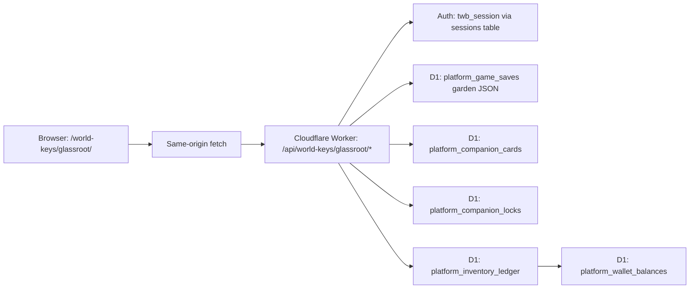

# TWB World Key Farming Game Research / Design Package

## Access Note And Assumptions

I could not directly open the Windows paths from this chat environment. I treated the project facts you provided as the local source of truth: existing Cloudflare Worker, D1 binding `TWB_DB`, account routes, platform tables, Unity companion fields, and current art direction. Before implementation, the first local step is to verify exact column names and route helpers in the listed files.

Core assumptions:

| Area | Assumption |
| --- | --- |
| Account | Browser version runs on `the-world-beneath.com` and uses the existing HttpOnly `twb_session` cookie. |
| Game identity | New `gameId`: `worldkey_glassroot` or `twb_glassroot_garden`. |
| Reward policy | MVP rewards only World Key token currency, not main-game usable items. |
| Companion policy | Up to 3 slotted Companions are actively locked while assigned to the garden. |
| Backend authority | Server owns timers, harvest eligibility, rewards, companion locks, and idempotency. |
| Art scope | MVP uses existing companion icons first, then upgrades to roaming mini-sprites later. |

## 1. Executive Recommendation

### Best Overall Approach

Build a browser-native 2.5D garden World Key using the existing TWB Cloudflare account/platform system. Do not create a separate login system. Do not start with a giant crafting economy. The first version should be a tight, visible loop:

plant crop -> watch visible growth -> assign up to 3 Companions -> Companions roam/help/fail sometimes -> harvest -> receive World Key garden tokens -> replant/expand.

Recommended engine stack:

| Layer | Recommendation |
| --- | --- |
| Game engine | Phaser 3.90 + TypeScript + Vite for first playable. |
| Layout | Stardew-like angled top-down 2D, not true 3D and not full isometric. |
| Map tooling | Tiled JSON or Phaser tilemaps. Phaser tilemaps support orthogonal, isometric, hexagonal, and staggered map types, and can parse Tiled JSON, CSV, or 2D array data. |
| Backend | Existing Cloudflare Worker + D1 + platform tables. |
| MVP persistence | `platform_game_saves` for garden JSON state first, with platform ledger/locks used immediately. |
| Production persistence | Move garden state to normalized D1 tables before wider public economy. |
| Assets | Reuse companion icons as roaming holo-companion tokens first; add crop stage sprites and black-ops alchemical garden UI. |

Cloudflare remains the right platform because D1 is Cloudflare's managed serverless database with SQLite semantics and Worker/HTTP API access, and Workers can serve static game assets alongside Worker logic and caching.

### Recommended Game Name / Work Title

World Key: Glassroot Garden

Why this name works:

- "Glassroot" feels like a World Key interface, not a normal farm.
- It blends hidden-world botany, alchemy, and magitech.
- It avoids sounding like generic fantasy farming.
- It can visually support black glass UI, luminous roots, cyan frames, and amber/gold status nodes.

Alternative names:

| Name | Notes |
| --- | --- |
| World Key: Glassroot Garden | Best MVP name. Clear and branded. |
| World Key: Underleaf Conservatory | More mystical, less direct. |
| World Key: Ledger Garden | Too economy-forward for MVP. |
| World Key: Verdant Lock | Nice device feel, less obviously farming. |

### Recommended First MVP Scope

The first playable should include:

- 1 farm screen.
- 24 usable plots.
- 6-8 active crops, with a 20-crop design roster prepared.
- 4 growth stages per crop: seed, sprout, mature, ready.
- Up to 3 assigned Companions.
- Companion roaming paths.
- Companion task actions:
  - water/tend,
  - ward,
  - harvest,
  - soil work,
  - pest clearing.
- Companion failure chances.
- Offline growth resolution.
- Server-authoritative harvesting and rewards.
- One placeholder reward currency: Glassroot Scrip.

## 2. Why This World Key Should Work Better Than Archaeology

The Archaeology World Key failed because it depended too much on generating coherent story/content at scale. This garden design avoids that by making the fun come from systems, not endless narrative generation.

### How This Avoids Story Chaos

| Archaeology problem | Glassroot solution |
| --- | --- |
| Too many generated stories needed | Plants have fixed definitions and predictable growth. |
| Content coherence was hard | The farm loop is visual, mechanical, and repeatable. |
| Story and gameplay were not tightly matched | Every action maps directly to a visible plot state. |
| Scaling required more writing | Scaling adds crops, plots, Companion behaviors, and art. |
| Randomness damaged tone | Randomness is limited to helper success/failure and crop quality. |

The garden can have flavor text, but it should be short and bounded. Example:

> "The mugwort stirs under the lens. Your Companion steadies the wardline."

That is enough. No generated quest paragraphs. No procedural mythology essays.

### Smallest Fun Loop

The smallest fun loop is:

1. Plant a real/mythic plant.
2. See it appear in the plot.
3. Wait a short time.
4. Watch a Companion walk to the plot and help.
5. See a success or harmless failure.
6. Harvest.
7. Receive tokens.
8. Replant or improve the garden.

The loop is fun even before alchemy, crafting, market systems, quests, or story.

### What Should Not Be Built Yet

Do not build these in MVP:

- Giant alchemy recipes.
- Player-to-player marketplace.
- Direct main-game item rewards.
- Generated story dig sites.
- Plant breeding genetics.
- Full NPC economy.
- Weather simulation.
- True open-world exploration.
- Real poison/herbal/medical instruction content.
- Companion breeding/trading.
- Farm building placement.
- Social visiting.
- Leaderboards.

The MVP should prove this first:

> "Planting, waiting, visible growth, Companion help, harvesting, and account-linked rewards feel good."

## 3. Canon Fit

### How This World Key Fits TWB

The Glassroot Garden is not just a cute farm. It is a World Key interface layer that lets awakened people cultivate symbolic plant-patterns from the World Beneath.

It should feel like:

- a private greenhouse hidden under ordinary reality,
- a magitech garden projected through the user's World Key,
- a controlled, Ledger-readable pattern farm,
- a safer, bounded way to gather World Key value without pulling physical loot into the main game.

The player is not growing normal inventory items yet. The World Key is reading growth patterns and converting successful harvests into World Key tokens.

### Device / Interface Feel

A World Key can appear as a watch, tattoo, necklace, glasses, implant, pocketwatch, or strange personal object. The Glassroot Garden interface should adapt to that canon:

| World Key form | Garden interface feel |
| --- | --- |
| Watch / lockwatch | Holographic farm grid opens above the wrist. |
| Tattoo | Luminous roots crawl across the skin and unfold into plots. |
| Necklace | Pendant projects a hanging conservatory lens. |
| Glasses | The farm overlays the real world as a hidden greenhouse. |
| Pocketwatch | The lid opens into a clockwork seedbed. |
| Implant | The garden appears as a neural black-glass dashboard. |

The UI should stay TWB: black glass, cyan/teal tactical frames, yellow-gold status nodes. The garden identity adds:

- deep green glow,
- rootline diagrams,
- amber alchemical labels,
- moon/ward glyphs,
- old botanical plate silhouettes,
- "conservatory under surveillance" mood.

### Companion Language

Player-facing language should say Companion, not "pet," wherever possible.

Good labels:

- "Assign Companion"
- "Companion Slot"
- "Companion is tending the garden"
- "Companion Card"
- "Bonded Helper"
- "Resting"
- "Locked to Garden Work"
- "Helping in Glassroot Garden"

Avoid:

- "Equip pet"
- "Pet inventory"
- "Owned creature"
- "Use animal"
- "Farm slave/helper"

Internal code can keep legacy pet terminology if needed, but the UI should preserve dignity and canon. Companion Cards are readouts, bonds, contracts, provenance records, summon patterns, constructs, or captured patterns -- not simply owned beings.

## 4. Core Game Design

### Player Loop

The core player loop:

1. Open the Glassroot Garden World Key.
2. Choose empty plot.
3. Plant crop.
4. Assign/adjust Companions.
5. Watch crops grow over real time.
6. Companions perform helper tasks.
7. Harvest ready crops.
8. Receive Glassroot Scrip.
9. Replant, unlock more crops, or improve plots.

### Session Loop

A normal 3-8 minute browser session:

| Moment | Player action | System response |
| --- | --- | --- |
| Login/open | Game fetches state | Server resolves offline growth/actions. |
| Scan farm | Player sees ready crops and active plots | UI highlights ready plots and Companion activity. |
| Harvest | Player clicks ready crop or "Harvest Ready" | Server validates and credits token reward. |
| Replant | Player chooses crop | Server stamps planted time and expected ready time. |
| Assign Companions | Player changes slots/focus | Server locks/unlocks companions. |
| Watch | Player sees Companions roam/help | Client animates, server remains authoritative. |
| Close | Player leaves | Growth continues by server timestamp math. |

### Idle / Timer Loop

Crops should grow through server timestamps:

- `planted_at`
- `ready_at`
- `last_resolved_at`
- `growth_modifiers_json`
- `status`

The browser can show timers and animations, but the browser does not decide when a crop is ready. The server decides.

### Farm State Loop

Plot states:

| State | Meaning |
| --- | --- |
| Empty | Available for planting. |
| Planted | Seed is placed, early stage. |
| Growing | Crop progresses through visual stages. |
| Needs Tending | Optional soft state; crop can still finish. |
| Ready | Can be harvested. |
| Harvested | Server processed reward; plot becomes empty. |

No crop death in MVP. Failure should delay, reduce quality slightly, or create funny misbehavior -- not destroy the player's progress.

### Offline Progress Loop

When the player opens the game:

1. Server loads garden save/state.
2. Server checks current server time.
3. Server calculates crop growth since `last_resolved_at`.
4. Server simulates Companion helper windows using deterministic RNG.
5. Server resolves auto-harvest if enabled.
6. Server writes updated state.
7. Server returns resolved farm state and reward summaries.

Offline cap recommendation:

| Phase | Offline cap |
| --- | --- |
| Internal prototype | 8 hours |
| MVP | 24 hours |
| Later | 72 hours or account-tier based |

This prevents abuse and keeps the game from becoming a pure claim-every-week simulator.

## 5. Farm Layout And 2.5D Presentation

### Recommended Perspective

Use Stardew-like angled top-down 2D, not true 3D and not full isometric.

Reason:

- Stardew's feel comes from angled sprites, depth sorting, visible characters, cozy map layout, and readable tiles.
- True isometric is harder for input, collisions, art, and mobile tapping.
- Full 3D is not needed for the MVP.
- A top-down/angled 2D farm can still feel rich with shadows, parallax, animated plants, and roaming Companions.

Recommended layout:

| Element | Recommendation |
| --- | --- |
| Tile size | 48px or 64px logical tiles. |
| Farm grid | Start with 12x10 or 14x10 visible garden area. |
| Plot beds | Use 1x1 crop plots grouped into 3x3 beds. |
| Depth | Sort sprites by Y position. |
| Camera | Fixed first, then small pan/zoom later. |
| Navigation | Click/tap plot, bottom/right info panel. |
| Mood | Dark greenhouse platform suspended in World Beneath space. |

### Tile / Plot Layout

MVP map:

- Center: 24 crop plots.
- Left: Companion slots / resting pads.
- Top: World Key device glyph / status header.
- Right: selected plot panel.
- Bottom: crop drawer, harvest button, Companion focus button.

Plot object fields:

| Field | Purpose |
| --- | --- |
| `plot_id` | Stable server ID. |
| `x`, `y` | Farm grid position. |
| `soil_tier` | MVP default 1. |
| `moisture` | Simple water/tending state. |
| `warding` | Soft risk reducer. |
| `crop_instance_id` | Current crop or null. |

### Camera / Navigation

Desktop:

- Mouse click plot.
- Hover tooltip.
- "Harvest Ready" button.
- Companion slots on side.
- Farm fits 16:9 without scrolling.

Mobile:

- Tap plot.
- Bottom sheet opens for plot/crop action.
- Large buttons.
- No tiny hover-only UI.
- Avoid true isometric hitboxes.
- Landscape-first is safer for MVP, but portrait can work with a tighter farm view and bottom sheet.

### How Companions Roam Without Overbuilding

Do not build full AI pathfinding first.

Use simple roam nodes:

- Each plot has an approach point.
- Each Companion slot has a home/rest point.
- Each Companion picks a visible task target.
- Companion moves along simple straight or L-shaped tween path.
- Y-depth sort makes it feel spatial.
- A small task icon appears above the Companion: water drop, sickle, ward glyph, soil rake.

Phaser has a PathFollower game object that can move a sprite along a path, which fits simple Companion patrols and task paths.

## 6. Plant / Crop System

### Safety Rule

All plant references are for game lore, symbolism, and fictional alchemical categories only. Do not provide real-world medical, poison, harvesting, preparation, dosage, or occult instructions. Some plants in the roster are toxic in the real world; for example, Britannica identifies belladonna as highly poisonous, RHS marks foxglove as toxic if eaten, and mandrake has both poisonous and folklore associations.

NCCIH's herb resources also emphasize that herbs/botanicals can have side effects and cautions, which supports keeping all plant effects fictional and non-instructional.

### MVP Crop Rules

Keep MVP simple:

| System | MVP recommendation |
| --- | --- |
| Growth time | Fixed per crop tier. |
| Water | One simple "tended" boost. |
| Warding | Reduces small mishap chance. |
| Moon | Visual flavor only in MVP, optional daily modifier later. |
| Compost | Wait until after MVP. |
| Crop death | Do not include. |
| Quality | Basic / Bright / Prime. |
| Harvest output | Glassroot Scrip only. |

### Growth Stages

Each crop has 4 visual stages:

1. Seed / Set
2. Sprout
3. Mature
4. Ready / Luminous

Optional 5th stage later: Overripe / Pattern-drift, but skip for MVP.

### Growth Time Tiers

| Tier | Playtest time | Production starting point |
| --- | --- | --- |
| Quick | 2-5 min | 10-15 min |
| Short | 5-10 min | 30-45 min |
| Standard | 15-20 min | 1.5-2 hr |
| Long | 30-45 min | 4-6 hr |
| Rare | 60-90 min | 8-12 hr |

For internal testing, use short timers. For live release, stretch them.

### Initial 20-Plant Roster

| Plant | Growth tier | Folklore / alchemy tag | Risk / benefit fantasy | Harvest category |
| --- | --- | --- | --- | --- |
| Mandrake | Rare | Root, Moon, Threshold | High value; may "shriek" and delay tending if poorly warded. | Root |
| Mugwort | Short | Moon, Dream, Hidden Roads | Helps reveal faint garden states; low risk. | Leaf |
| Yarrow | Quick | Thread, Ward, Binding | Good starter ward crop; stable yield. | Flower |
| Sage | Quick | Smoke, Clarity, Cleansing | Reliable crop; reduces garden "noise." | Leaf |
| Lavender | Quick | Calm, Sleep, Soft Light | Lowers Companion misbehavior chance. | Flower |
| Rue | Standard | Boundary, Bitter Ward | Strong ward crop; can resist pests. | Leaf |
| Vervain | Standard | Oath, River, Old Law | Good token yield when tended by high-Mgk Companion. | Herb |
| Wolfsbane / Aconite | Long | Beast, Thorn, Warning | Dangerous lore crop; high ward value; higher failure chance. | Flower |
| Belladonna | Long | Night, Shadow, Mirror | High token value; needs warding; no real-use text. | Berry |
| Foxglove | Long | Bell, Signal, Echo | Can create "resonant" harvest bonus; higher care difficulty. | Flower |
| Mistletoe | Rare | Host, Bond, Winter, Threshold | Slow crop; strong Companion-bond flavor. Mistletoe is parasitic in real botany, which fits the "host" tag. | Branch |
| Nettle | Quick | Sting, Resolve, Boundary | Starter crop with occasional "sting" misbehavior flavor. | Leaf / Fiber |
| Rosemary | Short | Memory, Oath, Return | Good for consistent token yield and Companion memory flavor. | Herb |
| Basil | Quick | Hearth, Luck, Green Flame | Friendly starter crop; low failure rate. | Herb |
| Thyme | Quick | Clock, Courage, Small Hours | Good timer-teaching crop. | Herb |
| Henbane | Long | Veil, Confusion, Night Road | Risky lore crop; failure may scramble task target. | Seed |
| Wormwood | Standard | Bitter Star, Signal, Absinthe-shadow | Medium yield; pairs with Moon/ward systems later. | Leaf |
| Angelica | Standard | Gate, Guard, Umbel | Defensive garden crop; good for warding tasks. | Root / Flower |
| Rowan | Rare | Red Thread, Protection, Threshold | High ward crop; later ties to home/gate systems. | Berry / Branch |
| Elder | Long | Lineage, Gate, Hollow Wood | Strong lore crop; later useful for alchemy/crafting. | Flower / Berry |

For MVP art, implement the first 6-8 crops visibly. Keep all 20 in the design roster, but avoid needing 80 finished crop sprites immediately.

Recommended first active crop set:

- Basil
- Thyme
- Yarrow
- Mugwort
- Lavender
- Sage
- Nettle
- Mandrake

## 7. Pet / Companion Helper System

### Slotting

The player can assign up to 3 Companions.

| Slot | Recommended name | Purpose |
| --- | --- | --- |
| Slot 1 | Companion A | General helper. |
| Slot 2 | Companion B | Unlock after short tutorial. |
| Slot 3 | Companion C | Unlock after first garden milestone. |

Each slot has a focus:

- Balanced
- Water / Tend
- Harvest
- Ward
- Soil
- Pest Clear

MVP can start with Balanced, Tend, Harvest, Ward.

### Roaming Behavior

Companions should visibly roam even when no task is active.

Roam states:

| State | Visual behavior |
| --- | --- |
| Idle | Loops near Companion pad. |
| Inspecting | Walks to random plot and looks around. |
| Helping | Moves to task plot and shows action icon. |
| Celebrating | Small bounce/glow after success. |
| Misbehaving | Wrong plot, confused spin, naps, startles, over-waters. |
| Resting | Returns to pad. |

Use existing companion icons first:

- icon with small shadow,
- bobbing animation,
- direction flip,
- task icon bubble,
- glowing outline by role.

Later upgrade to small animated creature sprites.

### Task Types

| Task | Main effect | Best Companion stat |
| --- | --- | --- |
| Watering / Tending | Slight growth speed boost or keeps crop in "tended" state. | Haste + Mgk |
| Harvesting | Auto-harvests or prepares ready crop for claim. | Haste + Might |
| Warding | Reduces mishap chance and improves rare crop stability. | Mgk + Hp |
| Soil Work | Small growth boost before planting or early growth. | Might + Hp |
| Pruning | Improves quality chance. | Haste + Mgk |
| Pest-clearing | Prevents minor delays. | Might + Haste |
| Calming | Reduces Companion failure / misbehavior chain. | Hp + Mgk |

### Chance To Fail

Companions should fail sometimes because that creates character. Failure must feel funny or interesting, not cruel.

Failure examples:

| Failure | Effect |
| --- | --- |
| Overwaters plot | No crop loss; growth boost skipped; moisture visual becomes chaotic. |
| Tends wrong plot | Half effect applied to another plot. |
| Gets startled | Task delayed. |
| Naps in the herbs | No effect; small funny animation. |
| Harvest fumble | Crop remains ready or reward quality drops one small step. |
| Ward misdrawn | Ward effect weaker, not harmful. |

### Failure Should Not Feel Punishing

Rules:

- No crop death in MVP.
- No permanent Companion damage.
- No full reward loss.
- Failure can delay, reduce bonus, or create a small "mess" to clear.
- The player should laugh, not rage.

Recommended default failure rates:

| Companion condition | Failure range |
| --- | --- |
| Strong match | 5-8% |
| Normal | 10-18% |
| Weak match | 20-30% |
| Integrity unstable | 35-50% |
| Broken | Cosmetic only; do not allow active work until repaired, unless canon says otherwise. |

## 8. Stat Transformation System

### Should BaseMgk Be Added To Cloudflare Companion Projection?

Yes. Add BaseMgk to the Cloudflare companion projection.

Reason:

- Unity `CreatureInstance` already has `BaseMgk`.
- Farming needs a clean stat for warding, alchemical sensitivity, moon/veil crops, and magical crop stability.
- Existing Cloudflare projection maps:
  - `BaseAttack = BaseMight`
  - `BaseDefense = BaseHp`
  - `BaseUtility = BaseHaste`
- Without `BaseMgk`, the garden would make all "magic gardening" depend on Haste, which weakens the TWB feel and flattens Companion identity.

Recommended projection addition:

| Unity field | Platform base stat | Garden use |
| --- | --- | --- |
| `BaseHp` | `base_hp` / `BaseDefense` | Endurance, ward stability, failure resistance. |
| `BaseMight` | `base_might` / `BaseAttack` | Soil work, pest clearing, harvest strength. |
| `BaseHaste` | `base_haste` / `BaseUtility` | Watering, harvesting speed, roaming frequency. |
| `BaseMgk` | `base_mgk` / `BaseMagic` | Warding, rare crops, moon/veil crop handling. |

### Role Transformation

Existing resolver:

| Highest stat | Role |
| --- | --- |
| Might | ATK |
| HP | DEF |
| Mgk or Haste | UTIL |

For farming, keep that role for compatibility, but add a sub-role:

| Role | Farming interpretation |
| --- | --- |
| ATK | Field force: soil work, pest clearing, harvest power. |
| DEF | Guardian: warding stability, crop protection, lower failure penalty. |
| UTIL-Haste | Quick helper: watering, harvest timing, roaming. |
| UTIL-Mgk | Arcane helper: warding, moon crops, rare crop quality. |

### Farming Stat Formulas

Use relative stat shares so the system works even if Unity stat scales change.

Let:

- `Total = BaseHp + BaseMight + BaseMgk + BaseHaste`
- `HpShare = BaseHp / Total`
- `MightShare = BaseMight / Total`
- `MgkShare = BaseMgk / Total`
- `HasteShare = BaseHaste / Total`

Then calculate profile scores:

| Farming stat | Formula |
| --- | --- |
| Soil Power | `100 * (0.55 * MightShare + 0.25 * HpShare + 0.20 * HasteShare)` |
| Water Care | `100 * (0.45 * HasteShare + 0.35 * MgkShare + 0.20 * HpShare)` |
| Harvest Care | `100 * (0.45 * HasteShare + 0.30 * MightShare + 0.25 * MgkShare)` |
| Ward Sense | `100 * (0.60 * MgkShare + 0.25 * HpShare + 0.15 * HasteShare)` |
| Endurance | `100 * (0.60 * HpShare + 0.25 * MightShare + 0.15 * MgkShare)` |
| Pest Clear | `100 * (0.45 * MightShare + 0.35 * HasteShare + 0.20 * HpShare)` |

Then apply multipliers:

| Factor | MVP rule |
| --- | --- |
| Level | `1 + min(Level, 50) * 0.01` |
| Rarity | Common 1.00, Uncommon 1.05, Rare 1.12, Epic 1.20, Legendary 1.30 |
| Integrity | Intact 1.00, Worn 0.85, Unstable 0.70, Broken 0.00 active work |
| Affinity match | +5% to +12% for matching crop/task tags |
| Skill match | +5% to +15% if Skills include matching helper category |

Example task success formula:

`SuccessChance = clamp(62% + FarmingStat * 0.25% + RoleBonus + AffinityBonus + SkillBonus - TaskDifficulty - FatiguePenalty - IntegrityPenalty, 35%, 95%)`

Role bonuses:

| Role | Bonus |
| --- | --- |
| ATK | +8% Soil, +8% Pest Clear, +4% Harvest |
| DEF | +8% Ward, +6% Endurance tasks, -5% failure penalty |
| UTIL-Haste | +8% Water, +8% Harvest, +4% Roam frequency |
| UTIL-Mgk | +10% Ward, +8% rare crop tending, +5% quality chance |

### What Lives Where

| Location | Should contain |
| --- | --- |
| `base_stats_json` | Raw canonical-ish projection from Unity/platform: `creatureId`, `instanceId`, `level`, `baseHp`, `baseMight`, `baseMgk`, `baseHaste`, `role`, `rarity`, `affinity`, `skills`, `integrityState`. |
| `game_projection_json` | Derived garden values: `garden.soilPower`, `garden.waterCare`, `garden.harvestCare`, `garden.wardSense`, `garden.failRateBase`, `garden.affinityTags`, `garden.roleBias`. |
| `state_json` | Mutable Companion/platform state only if truly global: integrity, broken/resting state, active locks, maybe fatigue if shared across games. |
| Garden assignment table/save | Game-specific mutable state: slot index, focus, last action time, garden fatigue, current task target, lock ID. |

Do not store permanent garden-only fatigue in the global Companion Card unless the main game should care about it.

## 9. Economy And World Key Tokens

### Reward Principle

Harvests should primarily reward World Key tokens, not normal usable items.

Recommended placeholder currency:

| Internal SKU | Display name | Purpose |
| --- | --- | --- |
| `wk_glassroot_scrip` | Glassroot Scrip | Primary garden World Key token. |
| `wk_garden_trace` | Garden Trace | Optional debug/internal reward unit; not necessary for MVP. |

Use one real player-facing token first: Glassroot Scrip.

### How Rewards Work In MVP

1. Each crop has a base token value.
2. Companion help can increase quality.
3. Failure can remove a bonus, not erase the harvest.
4. Server calculates final token amount.
5. Server writes idempotent ledger event.
6. Server updates player wallet.

Example reward model:

| Crop tier | Base Glassroot Scrip |
| --- | --- |
| Quick | 1-2 |
| Short | 3-5 |
| Standard | 6-10 |
| Long | 12-18 |
| Rare | 25-40 |

Quality modifier:

| Quality | Modifier |
| --- | --- |
| Basic | 1.0x |
| Bright | 1.15x |
| Prime | 1.35x |

### Database Shape For Tokens

Use existing platform economy tables:

| Existing table | Use |
| --- | --- |
| `platform_catalog` | Define `wk_glassroot_scrip` as a token/currency SKU. |
| `platform_wallet_balances` | Store account balance. |
| `platform_inventory_ledger` | Write credit events. |
| `platform_inventory_events` | Receive/record game-originated inventory events. |

Do not define final Ledger Concord marketplace rules yet. The only canon statement needed now:

> Glassroot Scrip is a World Key token type intended to be legible to future Ledger Concord clearing systems.

### Later Alchemy / Crafting Bridge

Later, crops can become:

- alchemy inputs,
- potions,
- pet food,
- crafting reagents,
- marketable crop patterns,
- plot upgrades,
- Companion bond materials.

But do not build those now. In MVP, the harvest is converted into a tokenized World Key reward.

## 10. Cloudflare Architecture

### Use Existing Worker + D1 + R2 Platform

Use the existing Cloudflare platform if feasible. It already has:

- website account login,
- `twb_session` cookie,
- D1 database,
- game saves,
- inventory events,
- Companion Cards,
- Companion locks,
- game-device link flow.

Cloudflare Workers receive requests through a fetch handler with request, env, and context; bindings expose resources such as D1/R2 to the Worker.

### Extend `worker.js` Or Add Separate Worker?

Recommendation for MVP:

Extend the existing Worker first.

Reason:

- Same account/session system.
- Same domain.
- Same cookie.
- Existing platform routes.
- No service-binding complexity.
- Faster to get a playable version.

Recommended route namespace:

| Route | Purpose |
| --- | --- |
| `GET /world-keys/glassroot` | Serves game shell/static page. |
| `GET /api/world-keys/glassroot/state` | Returns resolved garden state. |
| `POST /api/world-keys/glassroot/plant` | Plant crop. |
| `POST /api/world-keys/glassroot/harvest` | Harvest crop. |
| `POST /api/world-keys/glassroot/companions/assign` | Assign Companion slot. |
| `POST /api/world-keys/glassroot/companions/unassign` | Unassign Companion. |
| `POST /api/world-keys/glassroot/sync` | Resolve offline progress. |

Recommendation for later:

Move to a separate Worker only after MVP if:

- `worker.js` becomes too large,
- game-specific code needs independent deploys,
- more World Keys need a shared module pattern,
- route ownership becomes hard.

A later separate Worker can still use same D1 binding or call platform Worker through service bindings, but do not start there unless the current Worker is already unmanageable.

### Static Assets

For MVP, serve Phaser/Vite static assets from the Worker's static asset setup. Cloudflare Workers can upload and serve HTML, CSS, images, and other files as static assets with caching.

Use R2 later for larger asset bundles, crop atlases, or downloadable build packages. R2 buckets can be bound to Workers through Wrangler configuration and accessed inside the Worker.

### `platform_game_saves` First Or Normalized D1 Immediately?

MVP recommendation:

Use `platform_game_saves` first for the garden save JSON.

Reason:

- Faster first playable.
- Garden state shape will change.
- Existing routes already support game saves.
- Avoid premature schema churn.

But use normalized platform systems immediately for:

- Companion locks,
- reward ledger,
- inventory events,
- token balances,
- idempotency keys.

Production recommendation:

Move garden state to normalized D1 tables before public live economy.

Reason:

- Easier audit.
- Safer reward processing.
- Better fraud investigation.
- Cleaner lock conflict handling.
- Better analytics.
- Better partial updates.

D1 is appropriate for this because it provides SQLite semantics and supports prepared statements/batched statements through Worker bindings. D1 `batch()` can execute multiple statements in one call, sequentially and transactionally; if a statement fails, the sequence rolls back.

D1 limits still matter; for example, Cloudflare lists per-invocation query limits, so garden resolution should batch operations and avoid resolving hundreds of plot actions one-by-one.

### Proposed Production D1 Schema

Not SQL yet -- this is the shape.

#### `wk_garden_players`

| Field | Purpose |
| --- | --- |
| `user_id` | Platform user. |
| `garden_id` | Usually one garden per user. |
| `game_id` | `worldkey_glassroot`. |
| `garden_level` | Future progression. |
| `plot_capacity` | Current available plots. |
| `last_resolved_at` | Offline progress checkpoint. |
| `created_at`, `updated_at` | Audit. |

#### `wk_garden_plots`

| Field | Purpose |
| --- | --- |
| `plot_id` | Stable plot ID. |
| `user_id` | Owner. |
| `x`, `y` | Farm grid position. |
| `soil_tier` | MVP default 1. |
| `moisture` | Simple tending state. |
| `warding` | Protection state. |
| `current_crop_instance_id` | Nullable. |
| `state_json` | Small modifiers. |
| `updated_at` | Audit. |

#### `wk_garden_crop_instances`

| Field | Purpose |
| --- | --- |
| `crop_instance_id` | Unique crop run. |
| `user_id` | Owner. |
| `plot_id` | Plot. |
| `crop_def_id` | Crop type. |
| `planted_at` | Server timestamp. |
| `ready_at` | Server timestamp. |
| `harvested_at` | Nullable. |
| `status` | `planted/growing/ready/harvested`. |
| `quality_seed` | Server-created randomness seed. |
| `modifiers_json` | Companion/weather/ward/tending effects. |

#### `wk_garden_companion_assignments`

| Field | Purpose |
| --- | --- |
| `assignment_id` | Unique assignment. |
| `user_id` | Owner. |
| `companion_card_id` | Platform Companion Card. |
| `slot_index` | 1-3. |
| `focus` | `balanced/tend/harvest/ward/soil`. |
| `lock_id` | Link to `platform_companion_locks`. |
| `started_at` | Assignment start. |
| `last_action_at` | Helper action timing. |
| `assignment_state_json` | Game-specific fatigue/task state. |
| `active` | Boolean. |

#### `wk_garden_action_log`

| Field | Purpose |
| --- | --- |
| `action_id` | Unique action. |
| `idempotency_key` | Prevent duplicate action processing. |
| `user_id` | Owner. |
| `companion_card_id` | Nullable for player actions. |
| `plot_id` | Target. |
| `crop_instance_id` | Target crop. |
| `action_type` | `plant/tend/ward/harvest/etc`. |
| `outcome` | `success/fail/partial`. |
| `result_json` | Bonus/delay/reason. |
| `created_at` | Audit. |

#### `wk_garden_reward_events`

| Field | Purpose |
| --- | --- |
| `reward_event_id` | Unique reward event. |
| `idempotency_key` | Prevent double reward. |
| `user_id` | Owner. |
| `crop_instance_id` | Harvested crop. |
| `token_sku` | `wk_glassroot_scrip`. |
| `amount` | Server-calculated. |
| `ledger_event_id` | Link to platform ledger. |
| `created_at` | Audit. |

#### `wk_garden_idempotency_keys`

Use only if existing platform idempotency does not cover the garden routes.

| Field | Purpose |
| --- | --- |
| `user_id` | Scoped user. |
| `route` | Route/action. |
| `client_event_id` | Optional client-provided key. |
| `server_event_key` | Deterministic server key. |
| `response_hash` | Replay response. |
| `status` | `pending/succeeded/failed`. |
| `expires_at` | Cleanup. |

### How Existing Platform Tables Should Be Used

| Existing table | Garden use |
| --- | --- |
| `platform_games` | Register `worldkey_glassroot`. |
| `platform_catalog` | Define Glassroot Scrip token. |
| `platform_user_origins` | No major change unless origin affects crop lore later. |
| `platform_wallet_balances` | Store token balance. |
| `platform_inventory_stacks` | Avoid for MVP unless representing token stacks. |
| `platform_companion_cards` | Read Companion identity/stats. Add `BaseMgk` projection. |
| `platform_companion_locks` | Lock assigned Companions. |
| `platform_inventory_ledger` | Token credit audit trail. |
| `platform_game_saves` | MVP garden state JSON. |
| `game_device_link_requests` | Not needed for browser, still useful for Unity/game clients. |

## 11. Account And Companion Integration

### Browser Login

The browser farming game should run under the same site:

`https://the-world-beneath.com/world-keys/glassroot`

For logged-in website users:

- HttpOnly `twb_session` cookie authenticates them.
- Browser calls same-origin API routes.
- Frontend does not read the cookie directly.
- Worker validates session server-side.

For non-browser clients:

- Existing bearer-token game-device link flow can remain available.
- Do not build a new auth system.

### Reading Same Companions

The farming game should call:

`GET /api/platform/state`

Use returned:

- Companion Cards,
- Companion locks,
- wallet/token balances,
- platform inventory state,
- user origin if relevant.

The game should filter Companion Cards into:

| State | UI behavior |
| --- | --- |
| Available | Can assign. |
| Locked by Glassroot | Already assigned here. |
| Locked by another activity | Visible but cannot assign. |
| Broken/ineligible | Visible but disabled or cosmetic only. |

### Locking Companions

When player assigns a Companion:

1. Server verifies user owns/has access to the Companion Card.
2. Server checks existing `platform_companion_locks`.
3. Server creates lock:
   - `game_id = worldkey_glassroot`
   - `lock_reason = garden_assignment`
   - `companion_card_id`
   - `assignment_id`
4. Server writes garden assignment.
5. Server returns updated state.

When player unassigns:

1. Server marks assignment inactive.
2. Server releases the lock.
3. Server returns updated state.

### Preventing Same Companion From Being Used Elsewhere

Rule:

> A Companion with an active Glassroot Garden lock cannot be assigned to another game activity that respects platform locks.

This requires all games to check `platform_companion_locks` before assignment.

### Unity / Main Game Visibility

Unity/main game should see:

- Companion is locked,
- lock source: `worldkey_glassroot`,
- friendly display: "Helping in Glassroot Garden,"
- optional `locked_until` or "assigned until removed."

If Unity currently imports Companion Card projections but not locks, add lock data to the platform state/import contract.

## 12. Browser Engine / Technology Recommendation

### Clear Recommendation

Use Phaser 3.90 + TypeScript + Vite for the MVP.

Important 2026 note: Phaser 4 has been released very recently, with Phaser's archive listing v4.0.0 on April 10, 2026 and v4.1.0 on April 30, 2026. Phaser 3.90 remains the safer MVP choice because it is mature and documented for the tilemap/tooling needs here; use a short Phaser 4 spike only after the static playable is proven.

### Engine Comparison

| Candidate | Fit | Strengths | Weaknesses | Recommendation |
| --- | --- | --- | --- | --- |
| Phaser 3.90 | Excellent | Browser-native, Canvas/WebGL, good 2D game loop, tilemaps, sprites, tweens, input, easy Cloudflare static deploy. Phaser describes itself as an HTML5 framework for desktop/mobile browser games supporting Canvas and WebGL. | Not a full visual editor unless using Phaser Editor/Tiled. True isometric still needs care. | Use for MVP. |
| Phaser 4 | Promising | Current/new Phaser line. | Very fresh as of April 2026; higher integration risk. | Spike later, not MVP default. |
| PixiJS v8 | Very good renderer | Advanced 2D renderer, built on WebGL and optionally WebGPU. | Renderer, not full game engine. You build more systems yourself. | Fallback if Phaser feels too restrictive. |
| Godot HTML5 | Medium | Great editor, scenes, animation, 2D tooling. | Web export needs WebAssembly/WebGL 2; Godot docs note C# Godot 4 projects cannot currently export to web, and mobile web has performance caveats. | Not MVP unless team strongly prefers Godot. |
| Unity Web | Medium/low for this | Existing Unity knowledge and assets. Current Unity docs list desktop and some mobile browser support, including iOS Safari 15+ and Chrome 58+ on Android. | Heavy bundle, slower iteration, more complex Cloudflare/browser integration, duplicates main Unity project concerns. | Avoid for MVP. |
| Three.js / React Three Fiber | Medium | Good for true 3D. R3F is a React renderer for Three.js with declarative components. | Overkill for 2.5D farm; more 3D asset burden; UI/game loop complexity. | Not for MVP. |
| Babylon.js | Medium | Strong web 3D engine; Babylon describes itself as a web-based 3D/game engine. | Overkill for first farming loop; needs 3D assets and optimization. | Only if future version becomes true 3D. |

### Why Phaser Wins

Phaser is the best fit because:

- The game is primarily 2D/2.5D.
- It needs sprites, tilemaps, tweens, timers, and UI overlays.
- It can deploy as static browser assets.
- It keeps the game close to the web platform and Cloudflare.
- It avoids Unity/Godot WebAssembly payload complexity.
- It is easier to connect to same-origin API routes.
- It supports the right "visible farm + roaming helpers" MVP.

Fallback:

Fallback to PixiJS v8 + custom game loop only if Phaser's architecture blocks the desired UI/animation style.

Do not fallback to Unity WebGL unless the browser mini-game becomes a true Unity companion app. That would increase complexity too early.

## 13. Asset Plan

### Reuse Existing Companion Assets

Use existing companion/pet icons from:

- `C:\Users\yrred\Desktop\Game Art`
- `...\Assets\Resources\GameArt\TWB_HoloGlyph_T1\PetIcons`

MVP representation:

| Asset | Use |
| --- | --- |
| Companion icon | Roaming helper token. |
| Cyan outline | Available/active. |
| Gold pulse | Performing task. |
| Red/amber glitch | Failed task. |
| Small role badge | ATK/DEF/UTIL or task focus. |
| Shadow ellipse | Grounds the icon in the farm space. |

This avoids needing hundreds of new animated creature sprites.

### New Farming World Key Art Needed

Crop sprites:

Minimum MVP:

- 6-8 crops x 4 stages.
- Shared seed/soil/water overlays.
- Ready-state glow overlay.
- Optional generic "rare crop aura."

Full design roster later:

- 20 crops x 4 stages = 80 plant sprites.
- Better to build a reusable crop-stage template first.

Farm tiles:

Need:

- dark glass soil bed,
- normal soil tile,
- watered soil overlay,
- warded plot corners,
- path tile,
- Companion pad tile,
- empty plot tile,
- edge/border tile,
- greenhouse background/parallax.

UI panels/buttons:

Need:

- World Key header,
- Companion slot panel,
- crop selection drawer,
- selected plot panel,
- harvest button,
- "assign Companion" modal,
- token reward toast,
- offline progress summary.

Pet roaming representations:

MVP:

- icon token,
- 2-frame bob,
- path movement,
- task bubble.

Later:

- small chibi/field sprite,
- 4-direction walk,
- idle animation,
- specific task animation.

### Keep TWB Identity While Giving This World Key Its Own Look

Base TWB:

- black-ops holo glyph,
- dark glass,
- cyan/teal tactical framing,
- yellow-gold nodes,
- luminous contour glyphs.

Glassroot overlay:

- botanical glyph lines,
- living root diagrams,
- old alchemical labels,
- dark soil under glass,
- moon/ward indicators,
- green/amber glow,
- faint "Ledger scan" marks at harvest.

The look should be:

> tactical greenhouse + forbidden folklore botany + personal magitech interface.

Not cute-only. Not high fantasy farm. Not sci-fi lab only.

## 14. MVP Roadmap

### Milestones And Acceptance Criteria

| Milestone | Build goal | Acceptance criteria |
| --- | --- | --- |
| 1. Research/design lock | Lock scope and game identity. | Name, loop, crop roster, Companion rules, token policy, and backend direction approved. |
| 2. Static playable mock | Non-persistent farm screen. | Player can click plots, see crop stages mocked, see 3 Companion slots, no backend yet. |
| 3. Local prototype | Phaser local loop. | Plant, timer, grow, harvest works locally with fake data. |
| 4. Cloudflare account read | Connect to platform account. | Logged-in user can load `/api/platform/state`; unauthenticated user gets proper login state. |
| 5. Companion slotting | Assign real Companion Cards. | Up to 3 available Companions can be slotted; locked Companions cannot. |
| 6. Crop timers | Server-owned crop growth. | Server stamps `planted_at` and `ready_at`; browser cannot fake readiness. |
| 7. Pet automation | Companion tasks resolve. | Assigned Companions perform server-resolved helper actions and client-visible roaming. |
| 8. Harvesting | Server harvest. | Ready crop can be harvested once; duplicate requests do not duplicate rewards. |
| 9. Token rewards | Glassroot Scrip credits. | Harvest writes ledger event and updates wallet balance. |
| 10. Persistence/offline | Real saved garden. | Close/reopen resolves crop growth and Companion actions from server time. |
| 11. MVP polish | First playable package. | 6-8 crops, 24 plots, 3 slots, reward toast, offline summary, mobile-safe UI. |

Minimum viable content set:

| Content | MVP count |
| --- | --- |
| Active crops | 6-8 |
| Designed crop roster | 20 |
| Plots | 24 |
| Companion slots | 3 |
| Companion task types | 4-5 |
| Reward token types | 1 |
| Farm screens | 1 |
| Story events | 0 |
| NPC systems | 0 |

## 15. Risks And Pushback

### Scope Risks

| Risk | Pushback |
| --- | --- |
| "Make it like full Stardew" | Not in MVP. Start with one farm screen and visible Companions. |
| True isometric map | Avoid at first. It complicates click targets, art, and mobile. |
| 20 crops fully animated immediately | Design 20, ship 6-8 active crops first. |
| Full alchemy | Wait. Token harvest loop first. |
| Marketplace | Wait. Only define token ledger shape. |
| Story generator | Do not build. Use short fixed flavor lines only. |

### Technical Traps

| Trap | Avoidance |
| --- | --- |
| Client-side timers | Server owns `planted_at`, `ready_at`, reward amounts. |
| Duplicate harvest rewards | Use idempotency keys and ledger event IDs. |
| Companion lock conflicts | Every assignment checks `platform_companion_locks`. |
| Giant `worker.js` sprawl | Add route module structure or split later after MVP. |
| JSON save becoming messy | Use JSON for MVP, normalized D1 before public economy. |
| Offline automation abuse | Cap offline progress and resolve deterministically. |
| Phaser 4 freshness | Use Phaser 3.90 first; spike Phaser 4 later. |
| Art bottleneck | Use icons as roaming tokens first. |

### Economy / Security Risks

| Risk | Recommendation |
| --- | --- |
| Users spoof harvest requests | Server checks crop instance, owner, time, status. |
| Users duplicate requests | Idempotency key per harvest/action. |
| Users manipulate local time | Ignore client time. |
| Users assign same Companion elsewhere | Platform lock required. |
| Users farm infinite tokens through replay | Reward ledger should reject duplicate event IDs. |
| Token inflation | Start low, log everything, cap offline rewards. |
| Bot farming | Rate-limit state-changing routes; require valid session; monitor action frequency. |

### Existing System Changes Needed

Likely required changes:

- Add `BaseMgk` to Cloudflare Companion projection.
- Ensure `/api/platform/state` includes enough Companion stats for garden projection.
- Ensure `/api/platform/state` exposes active Companion locks.
- Add garden `gameId` in `platform_games` (`worldkey_glassroot` recommended).
- Add Glassroot Scrip in `platform_catalog` (`wk_glassroot_scrip` recommended for current platform ID style).
- Confirm `platform_inventory_events` supports source game + idempotency key.
- Confirm `platform_companion_locks` can represent long-running garden assignment.
- Update Unity import/contract so main game can see "Helping in Glassroot Garden" lock state.
- Add garden API routes under existing Worker.
- Decide whether garden state starts as `platform_game_saves` JSON or immediately gets route-specific tables; recommendation is JSON first, normalized before public economy.

## 16. Open Questions For The Creator

Only these block implementation decisions:

1. Should a Companion assigned to Glassroot Garden be fully unavailable for all other active activities, or only unavailable for other automation systems?
   - My recommendation: fully unavailable for active work, still viewable everywhere.
2. Does the current Companion Card data already have rarity and affinity, or should the garden derive temporary affinity from `CreatureId`/skills until the main system defines it?
3. Should Glassroot Scrip be game-specific forever, or should it be a temporary garden token later cleared into a broader World Key token by the Ledger Concord?
   - My recommendation: game-specific for MVP, Ledger-cleared later.
4. Can broken Companions appear cosmetically in the garden, or should they be hidden from assignment entirely?
   - My recommendation: visible but not assignable for active tasks.
5. Should auto-harvest credit tokens immediately during offline resolution, or place rewards into a "pending claim" summary when the player returns?
   - My recommendation: pending claim for better player satisfaction, but still server-created and idempotent.

## 17. Confirmed Platform / Website / Database Integration Notes

Research date: 2026-05-10.

Sources inspected:

- Local website Worker repo: `C:\Users\yrred\Desktop\BoB-Console\the-world-beneath-site`
- Live website routes on `https://the-world-beneath.com`
- Live Cloudflare D1 database through Wrangler read-only inspection
- Worker API implementation in `worker.js`
- Browser platform helper in `assets/js/twb-platform-client.js`
- Current site content under `world-keys/`

### Confirmed Cloudflare / Website Status

The public website is currently served by a Cloudflare Worker, not by a separate standalone game host.

Confirmed Worker configuration:

| Area | Confirmed value |
| --- | --- |
| Worker name | `the-world-beneath-site` |
| Worker entry | `worker.js` |
| Primary domains | `the-world-beneath.com`, `www.the-world-beneath.com` |
| Additional domains | `freebob.net`, `www.freebob.net` |
| D1 binding | `TWB_DB` |
| D1 database | `twb-core` |
| Static asset binding | `ASSETS` |
| Static asset directory | Website repo root |
| R2 binding | `BOB_PACKAGES` |
| R2 bucket | `twb-bob-packages` |

Live endpoint checks:

| Route | Status | Meaning |
| --- | ---: | --- |
| `/api/health` | 200 | Worker API is live. |
| `/api/platform/manifest` | 200 | Shared platform manifest is live. |
| `/api/platform/state` without login | 401 | Platform state correctly requires authentication. |
| `/login/` | 200 | Website login page exists. |
| `/register/` | 200 | Website registration page exists. |
| `/game-link/` | 200 | Device link flow page exists. |
| `/game/` | 200 | Browser game landing page exists. |
| `/world-keys/` | 200 | World Key landing page exists. |

Current World Key page status:

The public `world-keys/` page says the first public World Key is being redesigned, the previous pilot is retired, and the World Key marketplace is coming later. This fits the Glassroot Garden plan well: the farming World Key can become the new replacement pilot instead of having to preserve the old archaeology pilot.

Important correction to the earlier plan:

The live platform manifest currently lists only these platform games:

| Game ID | Status | Notes |
| --- | --- | --- |
| `twb-idle-prototype` | active | Current prototype/main integration target. |
| `twb-main` | planned | Future main game identity. |

There is no live `twb-archaeology` platform game in the manifest now. Older archaeology files and migrations may have existed previously, but the current live platform has been simplified.

### Confirmed Login / Account System

The website already has an account system using the `users` and `sessions` tables.

Confirmed browser login behavior:

1. User logs in through the website.
2. Worker creates an HttpOnly `twb_session` cookie.
3. Browser pages do not read the cookie directly.
4. Same-origin API routes authenticate the request server-side.
5. `/api/me` and `/api/platform/state` expose account/platform state to authenticated users.

Confirmed non-browser client behavior:

The Worker also supports bearer-token authentication through linked game clients. This is for Unity/native/game-device style clients, not the browser farming game.

Relevant device link routes:

| Route | Purpose |
| --- | --- |
| `/api/game/link/start` | Starts device link request. |
| `/api/game/link/approve` | Website user approves link. |
| `/api/game/link/poll` | Device polls for approval. |
| `/api/game/link-device` | Legacy/compatibility link route. |

Glassroot Garden recommendation:

Use the website session cookie path for the browser farming game. Do not create a new login system. Do not make the browser client handle bearer tokens. The browser game should live on the same origin and call the same Worker API.

Recommended browser flow:

1. Player opens `/world-keys/glassroot/`.
2. Frontend calls `/api/me` or `/api/platform/state`.
3. If unauthenticated, UI sends player to `/login/`.
4. If authenticated, frontend calls `/api/world-keys/glassroot/state`.
5. Worker resolves garden state using the authenticated `user_id`.

### Confirmed Database Status

The live D1 database already has the shared platform foundation.

Important tables confirmed:

| Table | Current role |
| --- | --- |
| `users` | Website accounts. |
| `sessions` | Website login sessions. |
| `linked_game_clients` | Device/client bearer-token links. |
| `game_device_link_requests` | User-code device link flow. |
| `platform_games` | Registered platform games. |
| `platform_catalog` | Currency/item/companion catalog definitions. |
| `platform_wallet_balances` | Account-scoped currency balances. |
| `platform_inventory_stacks` | Account-scoped item/material stacks. |
| `platform_companion_cards` | Account-scoped Companion Cards. |
| `platform_companion_locks` | Active Companion assignment locks. |
| `platform_inventory_ledger` | Idempotent platform reward/event audit trail. |
| `platform_game_saves` | Per-user, per-game save JSON blobs. |
| `platform_user_origins` | User origin/profile metadata. |

Current live platform content:

| Area | Current count / content |
| --- | --- |
| Users | 3 |
| Sessions | 3 |
| Platform games | `twb-idle-prototype`, `twb-main` |
| Catalog entries | `will` only |
| Wallet balances | 0 |
| Companion Cards | 0 |
| Companion locks | 0 |
| Platform game saves | 0 |
| Platform inventory ledger events | 0 |
| Linked game clients | 0 |
| Device link requests | 3 |

Interpretation:

The platform skeleton is real and live, but the game economy and Companion Card population are still mostly empty. Glassroot Garden can integrate into the existing system, but companion slotting cannot fully work until the main game or import pipeline writes Companion Cards into `platform_companion_cards`.

### Confirmed API Surface

Current Worker routes include:

| Route | Current purpose |
| --- | --- |
| `/api/health` | Health check. |
| `/api/auth/register` | Register website account. |
| `/api/auth/login` | Login and create session cookie. |
| `/api/auth/logout` | Logout and clear session. |
| `/api/me` | Current authenticated user. |
| `/api/platform/manifest` | Platform route/game/catalog manifest. |
| `/api/platform/state` | Account platform state. |
| `/api/platform/origin` | User origin updates. |
| `/api/platform/inventory/events` | Generic platform inventory event ingestion. |
| `/api/platform/game-saves/:gameId/:saveKey` | Generic game save GET/PUT/PATCH. |
| `/api/game/link/start` | Device link start. |
| `/api/game/link/approve` | Device link approval. |
| `/api/game/link/poll` | Device link polling. |
| `/api/game/link-device` | Compatibility link route. |
| `/api/game/sync-snapshot` | Game/client snapshot sync. |

The browser helper `assets/js/twb-platform-client.js` already wraps:

- manifest fetch
- account login/register/logout
- device link start/approve/poll
- platform state fetch
- game save get/put/patch
- origin update/patch
- generic inventory event application
- helper calls for reward, Companion lock, and Companion release events

### Critical Reward Authority Finding

This is the most important implementation finding.

`/api/platform/inventory/events` is idempotent and validates ownership/spending/lock conflicts, but it is not a game-rule authority for Glassroot harvests. It accepts requested currency deltas from the authenticated request and writes them through the platform ledger after validation.

That is useful for trusted game servers or controlled platform flows, but the Glassroot browser client must not directly call the generic inventory event route to mint harvest rewards.

Required Glassroot rule:

All planting, growth, helper resolution, harvest validation, and token rewards must go through dedicated server-owned routes such as:

| Route | Server responsibility |
| --- | --- |
| `GET /api/world-keys/glassroot/state` | Load account, resolve offline garden progress, return garden state. |
| `POST /api/world-keys/glassroot/plant` | Validate plot/crop and stamp server `planted_at` / `ready_at`. |
| `POST /api/world-keys/glassroot/harvest` | Confirm crop belongs to user, is ready by server time, has not already paid, then credit token. |
| `POST /api/world-keys/glassroot/companions/assign` | Validate Companion ownership and create platform lock. |
| `POST /api/world-keys/glassroot/companions/unassign` | Release Glassroot assignment lock. |
| `POST /api/world-keys/glassroot/sync` | Resolve growth/helper actions using server time. |

The dedicated Glassroot route can internally use the same ledger-writing helpers/patterns as `/api/platform/inventory/events`, but the browser should only be allowed to request game actions, not arbitrary reward amounts.

Idempotency recommendation:

Use deterministic source event IDs for reward ledger writes, for example:

```text
source_game_id = worldkey_glassroot
source_event_id = glassroot:harvest:{crop_instance_id}
```

The existing ledger has a uniqueness rule on:

```text
user_id + source_game_id + source_event_id
```

That is exactly what Glassroot needs to prevent duplicate harvest payouts.

### Recommended Platform IDs

The GPT Pro plan used upper-case token IDs such as `WK_GLASSROOT_SCRIP`. The current live catalog uses lower-case/simple IDs such as `will`. To match the existing platform style, use lower-case IDs in D1 and display-friendly names in UI.

Recommended final IDs:

| Concept | Recommended ID | Display name |
| --- | --- | --- |
| Game | `worldkey_glassroot` | World Key: Glassroot Garden |
| Currency/catalog ID | `wk_glassroot_scrip` | Glassroot Scrip |
| MVP save key | `garden` | Garden |

### Required Migration / Seed Work

Before the farming World Key can run live, add or seed:

| Area | Needed change |
| --- | --- |
| `platform_games` | Insert `worldkey_glassroot` as active or planned. |
| `platform_catalog` | Insert `wk_glassroot_scrip` as a currency. |
| `platform_game_saves` | No schema change needed for MVP JSON save. |
| `platform_companion_cards` | Populate from main game/Unity companion data. |
| `platform_companion_locks` | Existing shape can support Garden assignment locks. |
| `platform_inventory_ledger` | Use existing idempotent ledger pattern for harvest credits. |
| Worker routes | Add `/api/world-keys/glassroot/*` authoritative routes. |
| Static website | Add `/world-keys/glassroot/` browser game build. |

Potential migration rows:

```sql
INSERT OR IGNORE INTO platform_games (
  game_id,
  display_name,
  status,
  payload_json
) VALUES (
  'worldkey_glassroot',
  'World Key: Glassroot Garden',
  'active',
  '{"role":"world-key","worldKey":"glassroot"}'
);

INSERT OR IGNORE INTO platform_catalog (
  catalog_id,
  catalog_kind,
  display_name,
  source_game_id,
  rarity,
  stack_policy,
  trade_policy,
  payload_json
) VALUES (
  'wk_glassroot_scrip',
  'currency',
  'Glassroot Scrip',
  'worldkey_glassroot',
  'common',
  'stackable',
  'account_bound',
  '{"tokenFamily":"world-key","worldKey":"glassroot"}'
);
```

### Companion Integration Reality Check

The schema already supports Companion Cards and locks, but the live table currently has zero Companion Cards.

That means the first implementation has two phases:

1. Build the garden with mock/local Companion fixtures for visual prototype work.
2. Wire real Companion slotting once the main game/platform import creates `platform_companion_cards`.

Companion data currently expected by Glassroot:

| Data | Current platform support | Needed for Glassroot |
| --- | --- | --- |
| Companion identity | Supported by `platform_companion_cards` | Must be populated. |
| Companion base stats | Supported through `base_stats_json` | Add/confirm `BaseMgk`. |
| Game projections | Supported through `game_projection_json` | Add garden projection fields. |
| Mutable condition | Supported through `state_json` | Confirm integrity/broken/resting shape. |
| Assignment lock | Supported by `platform_companion_locks` | Use for Garden slotting. |

BaseMgk recommendation remains unchanged:

Add or preserve magic stat data in the Companion projection. The garden needs this for warding, rare crop handling, alchemical sensitivity, and magical failure/success calculations.

Lock behavior recommendation:

Use `platform_companion_locks` for active garden assignments. A Companion assigned to Glassroot should be viewable everywhere, but unavailable for other active work until unassigned.

One design choice remains:

| Lock style | Pros | Cons |
| --- | --- | --- |
| Open-ended lock with `locked_until = null` | Simple for idle assignment. | Requires explicit unassign and cleanup tooling. |
| Renewable timed lock | Safer cleanup if bugs occur. | More implementation work. |

Recommendation:

Use open-ended locks for local prototype/internal MVP, then consider renewable locks before a public reward-heavy launch.

### Website Deployment Shape

The local farming project lives at:

```text
C:\Users\yrred\Desktop\Unity\TWB-Farming
```

That folder is appropriate as the working/game source folder.

The live website repo is:

```text
C:\Users\yrred\Desktop\BoB-Console\the-world-beneath-site
```

Recommended build/deploy shape:

1. Build the Phaser/Vite game in `TWB-Farming`.
2. Output static files.
3. Copy or package the built static game into the website repo under:

```text
world-keys/glassroot/
```

4. Keep shared/static game assets under either:

```text
world-keys/glassroot/assets/
```

or:

```text
assets/world-keys/glassroot/
```

5. Add authoritative API routes in the website Worker `worker.js`.
6. Deploy through the existing Cloudflare Worker deployment flow.

Because the Worker uses `run_worker_first: true`, API routes and static assets can coexist under the same domain.

Recommended browser URL:

```text
https://the-world-beneath.com/world-keys/glassroot/
```

Recommended API namespace:

```text
/api/world-keys/glassroot/*
```

### MVP Persistence Decision After Inspection

The earlier recommendation to start with `platform_game_saves` is still acceptable, with one important caveat.

Safe use:

- Store the garden JSON blob in `platform_game_saves`.
- Let only dedicated Glassroot server routes mutate authoritative fields.
- Keep crop readiness, reward decisions, and Companion action resolution server-owned.

Unsafe use:

- Let the browser directly PATCH arbitrary garden save JSON for planted crops, ready crops, or reward-bearing state.

Recommended MVP save shape:

```text
user_id = authenticated user
game_id = worldkey_glassroot
save_key = garden
save_json = authoritative garden state written by Worker route logic
```

Move to normalized tables before public economy if:

- rewards become meaningful,
- garden state grows beyond one small farm,
- analytics/fraud review become important,
- many simultaneous actions need clean partial updates.

### Current Gaps / Risks To Track

| Risk | Confirmed status | Recommendation |
| --- | --- | --- |
| Generic inventory event route can mint requested positive currency deltas | Confirmed | Do not expose harvest rewards through direct client calls to this route. Add Glassroot server authority. |
| Companion Cards are absent in live D1 | Confirmed | Prototype with mock data, then add/import real cards. |
| Existing catalog only has `will` | Confirmed | Add `wk_glassroot_scrip`. |
| Existing games only include idle prototype and main planned game | Confirmed | Add `worldkey_glassroot`. |
| Shared platform contract doc appears deleted/missing in current site repo | Confirmed locally | Recreate/update contract once Glassroot API is designed. |
| Site repo is currently very dirty, including old archaeology deletions | Confirmed locally | Avoid mixing large unrelated cleanup with Glassroot work. |
| Old archaeology assumptions may be stale | Confirmed by manifest mismatch | Treat live manifest/D1 as source of truth. |
| Client-side timers would be exploitable | Design risk | Server owns `planted_at`, `ready_at`, reward amount, and idempotency. |

### Integration Summary

Glassroot Garden should integrate as a same-origin browser World Key under the existing website and account system.

The clean architecture is:



The browser game should be animated and responsive, but the Worker must be the authority for:

- identity,
- plot ownership,
- crop timers,
- Companion assignment locks,
- helper success/failure,
- harvest eligibility,
- reward amounts,
- token ledger writes,
- duplicate payout prevention.

This confirms the original high-level plan, with one correction of consequence: the game should not rely on the generic platform inventory event endpoint as the reward authority. Glassroot needs its own small authoritative server API.

## Clear Recommended First Build Plan

Build World Key: Glassroot Garden as a Phaser 3.90 browser game served under the existing TWB site.

First build target:

1. Add `worldkey_glassroot` game registration.
2. Add `wk_glassroot_scrip` token SKU.
3. Create a static Phaser farm screen with 24 plots.
4. Use `platform_game_saves` for MVP garden JSON.
5. Add garden API routes to existing `worker.js`.
6. Use `/api/platform/state` to read account, wallet, Companion Cards, and locks.
7. Add `BaseMgk` to Companion projection before finalizing farming formulas.
8. Implement server-owned plant/harvest timers.
9. Add 3 Companion slots with platform locks.
10. Animate Companions as roaming icon tokens first.
11. Resolve helper actions and failures server-side.
12. Credit Glassroot Scrip through existing platform ledger with idempotency.
13. Move to normalized garden D1 tables before public/reward-heavy launch.

The first playable should prove one thing:

> A player can open their World Key, plant real folklore/alchemical crops, watch them grow, see their actual TWB Companions help or mess up, harvest safely, and earn a Ledger-ready World Key token -- without needing a giant story generator or a giant economy.
