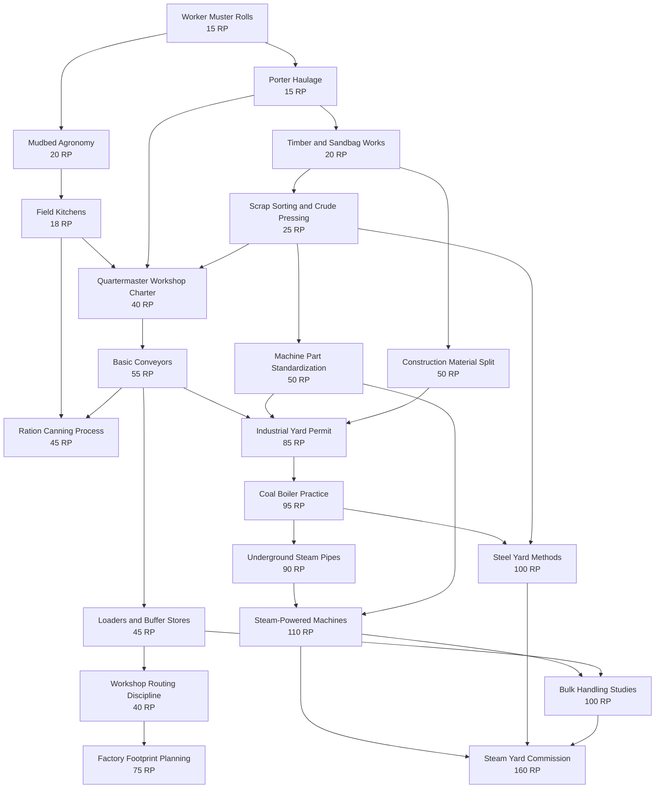
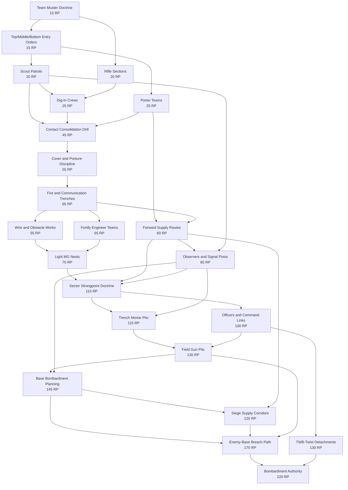

# 2026-05-16 TWB Trenchworks Research Tree Design Report

## Scope and assumptions

Scope: standalone Unity 2D grid/box game under The World Beneath umbrella. This report designs prototype research content for TWB Trenchworks only.

Active project:

```text
C:\Users\yrred\Desktop\Unity\TWB-Trenchworks\TWB-TrenchWorks
```

This worker did not edit Unity source files and did not edit permanent memory. The only intended output is this report under `memory\short-term`.

Assumptions:

- Research Points are a single generic spendable pool. The player must choose whether to spend the shared pool on Production Research or War Research.
- Three playable research tiers are enough for the next prototype phase. Later Tier 4 arcane industry and Tier 5 siege/binding works should remain visible in design direction, but not implemented as playable research yet.
- Research unlocks should be data-driven and should gate catalog/build/menu availability, not be hard-coded into UI branches.
- Current catalog and implementation slices are isolated foundations. This design must be compatible with the existing id-based catalog, production slice, and war-team foundation, but should not assume they are already live-integrated.
- Research costs below are prototype-relative. They are meant to establish pacing and tradeoff shape, not final balance. A typical early session might produce 1 to 3 RP per minute once the first research desk is fed.

## Source inventory summary: what units/items/buildings/concepts were found

Read required sources:

- Full implementation plan and wireframes.
- Production and military consolidated design.
- Catalog foundation implementation report.
- Current `TrenchworksCatalog.cs`.
- War team AI foundation implementation report.
- Production first slice implementation report.

Also read available current extension/source reports:

- Catalog validation/layout implementation report.
- Worker, food, coal, and essence addendum.
- Factory construction materials addendum.
- Team-spawning military addendum.
- Military units and fortifications design report.
- Crafting and logistics design report.

Current catalog resources found:

- Fungal Loam, Raw Food, Coal, Water, Essence, Timber, Heavy Scrap, Fiber Reed, Stone Clay, Steam.

Current catalog items found:

- Fungal Loam, Raw Food, Worker Meal, Front Rations.
- Coal, Water, Essence, Timber, Planks, Sandbags, Heavy Scrap, Fiber Reed, Stone Clay.
- Steel Plate, Machine Part, Conveyor Part, Boiler Part, Steam, Steam Pipe Part, Basic Conveyor.
- Legacy frontline crates: Ammo Crate, Trench Materials Crate, Rations Crate, Medical Supplies Crate.

Current catalog recipes found:

- Raw Food From Mudbed.
- Worker Meals.
- Front Rations.
- Boiler Steam.
- Planks From Timber.
- Steel Plate From Scrap.
- Machine Parts.
- Conveyor Parts.
- Sandbags From Fiber.

Current catalog machines/buildings found:

- Extractor.
- Mudbed Farm.
- Field Kitchen.
- Small Boiler.
- Workshop.
- Conveyor Workshop.
- Sawmill.
- Storage.
- Shipping Depot.

Current catalog transports found:

- Basic Conveyor.
- Loader.
- Underground Steam Pipe.
- Depot Access Lane.

Current catalog units found:

- Patrol Corporal.
- Scout.
- Rifleman.
- Sapper.
- Combat Medic.
- Quartermaster Runner.
- Porter.
- Field Engineer.
- MG Gunner.

Current catalog team templates found:

- Scout Patrol.
- Dig-In Crew.
- Assault Section.
- Porter Team.

Current catalog fortifications/emplacements found:

- Scrape.
- Foxhole.
- Fire Trench Segment.
- Wire Belt.
- Light MG Nest.
- Trench Mortar Pit.

Additional planned production concepts found in design reports:

- Workers: Labourer, Farmer, Machine Operator, Steam Engineer, Essence Tender, Mechanic, Quartermaster, Factory Builder, Clockwork Servitor.
- Food chain: Fungal Loam/Root-Meal plus Water plus Essence plus farmer labour into Raw Food, then Worker Meals, Basic Rations, Ration Crates, Strategic Ration Reserves.
- Coal/steam chain: Coal plus Water into boilers, underground steam pipes, steam-powered machines, powered loaders, steam carts, chemical vats, shell forges, concrete mixers.
- Essence/magic chain: Essence taps, essence conduits, ward plates, aether batteries, warded storage, command relays, TWB twist units, bombardment stabilization.
- Construction chains: Planks, Sandbags, Wire Coils, Duckboards, Braces, Concrete/Revetments, Hand Tools, Steel Plates, Machine Parts, Conveyor Parts, Boiler Parts, Steam Pipe Parts, Essence Conduit Parts, Factory Foundations.
- No-train bulk transport: cable-haul freight skids, crawl-haulers, overhead chainways, pneumatic vault tubes, aether-lift gantries.

Additional planned war concepts found in design reports:

- Three 10 x 10 entry zones per side: top, middle, bottom.
- War team families: Scout, Dig/Fortify, Assault, Supply/Logistics, Command/Observer, Emplacement Crew.
- Officers: Patrol Corporal, Trench Lieutenant, Artillery Observer, Quartermaster Captain, Choir-Major.
- Normal soldiers: Rifleman, Scout, Grenadier, Bayonet Stormer, Trench Marksman.
- Engineers/support: Sapper, Field Engineer, Wire Cutter, Signaller, Combat Medic.
- Heavy/emplacement crews: Machine-Gun Crew, Trench Mortar Crew, Field Gun Crew, Bombardment Crew, Pressure Projector Crew.
- TWB twist units: Aether Lamp Scout, Clockwork Trenchhand, Grave-Salt Warden, Echo Runner, Bound Shell Cantor.
- Logistics sub-units: Porter, Stretcher Bearer, Shell Runner, Quartermaster Runner.
- Cover/posture: exposed, half cover, full cover, head-up, crouched, pinned, braced-working, dug-in.
- Contact progression: none, suspected, confirmed, held, consolidated.
- Fortifications: scrape, foxhole, fire trench, communication trench, reinforced trench, sandbag wall, wire, rubble barricade, dugout, bunker, observation/listening post, aid post, ammunition niche, command post, aether relay.
- Emplacements and artillery: light/heavy MG nest, trench mortar pit, field gun pit, siege platform, signal/spotter post, aether searchlight, clockwork loader station, warded shell cache, pressure projector pit.
- Victory path: enemy base destruction should come from scouts/observers, held positions, supply routes, artillery/siege emplacements, shells, targeting, command, and bombardment goods, not a single abstract progress bar.

## Research economy proposal: research buildings, inputs consumed, rates, bottlenecks

### Core rule

Research Points are generic:

```text
Research Point pool
  -> spent on Production Research nodes
  -> or spent on War Research nodes
```

The game should never produce separate "production points" and "war points" in the first implementation. That would politely dodge the design's sharpest decision.

Research production should be a factory process:

- It occupies grid space.
- It consumes worker food, materials, and later steam/essence.
- It competes with front supply and factory expansion.
- It produces no physical crate by default. It adds generic RP to a research ledger.
- It has clear blocked reasons, just like machines.

### Research-producing buildings

| Building | Tier | Footprint | Inputs consumed | Output | Why it exists |
|---|---:|---:|---|---|---|
| Drafting Desk | 1 | 2 x 2 | Worker Meal 1, Planks 1 every 20s, 1 worker access lane | 1 RP / 20s | First research source using only early food and timber. Forces a small worker-food tax. |
| Field Records Office | 1 | 3 x 2 | Worker Meal 1, Front Rations 1 every 25s, paper abstracted as Planks 1 | 1 RP / 15s | Turns battlefield reports and rationed staff time into research. Creates early worker/front food tension. |
| Prototype Bench | 2 | 3 x 3 | Worker Meal 1, Steel Plate 1, Machine Part 1 every 35s | 3 RP / 35s | Makes steel and machine parts compete between expansion and faster research. |
| Survey/Signals Room | 2 | 3 x 2 | Worker Meal 1, Copper/Signal Kit later, Front Rations 1 every 30s | 2 RP / 30s, plus war-node discount hooks later | Uses war-side observations without creating a separate war currency. Until copper/signal kits exist, use Front Rations as the practical input. |
| Steam Test Lab | 3 | 4 x 3 | Worker Meal 2, Steam pressure, Steel Plate 1, Steam Pipe Part 1 every 40s | 5 RP / 40s | Makes steam research spatially demanding and dependent on boiler/pipe layout. |
| Essence Analysis Cell | 3 | 3 x 3 | Worker Meal 1, Essence 1, Sandbags/Stone Clay safety cost every 45s | 4 RP / 45s, instability warning if overdrawn | Introduces the food versus essence conflict without requiring full Tier 4 magic. |

Prototype balance notes:

- The first two research buildings are deliberately modest. The player should feel the cost of spending workers on research before the tree becomes large.
- The Prototype Bench is the first real acceleration. It should make steel and machine parts feel painfully useful.
- The Steam Test Lab should require underground pipe connectivity. It must not be just a more expensive Desk.
- The Essence Analysis Cell should be optional and tempting, because essence also feeds farms and later TWB war tools.

### Research bottlenecks and grid pressure

Research buildings should be awkward enough to matter:

- Drafting Desk needs worker access but no belt input. It rewards compact worker lanes.
- Field Records Office should sit near shipping/war dispatch because it consumes front reports and rations.
- Prototype Bench needs belt or loader access for plates/parts and a worker lane.
- Steam Test Lab needs surface inputs and underground steam connection. A badly routed pipe layer should block it.
- Essence Analysis Cell should need an essence input port or adjacency to essence storage/tap once implemented.

Recommended diagnostics:

- "Drafting Desk idle: worker meal missing."
- "Field Records Office idle: front reports/rations missing."
- "Prototype Bench blocked: machine parts reserved for factory expansion."
- "Steam Test Lab idle: no steam connection."
- "Essence Analysis Cell unstable: essence overdraw."

## Production tree: tier 1, tier 2, tier 3, dependencies, capstones

### Production Tier 1 - Hand Sustenance and Manual Works

Goal: make workers, food, basic materials, manual hauling, and first factory growth visible before conveyors and steam.

| Id | Node | Cost | Prerequisites | Unlock outputs | Why this node exists |
|---|---|---:|---|---|---|
| prod.t1.worker_muster | Worker Muster Rolls | 15 RP | none | Labourer/Porter worker pool UI, worker assignment categories | Establishes workers as a managed resource instead of invisible throughput. |
| prod.t1.mudbed_agronomy | Mudbed Agronomy | 20 RP | Worker Muster Rolls | Mudbed Farm, Fungal Loam + Water + Essence -> Raw Food | Food should be grown through a machine, not appear from a node. |
| prod.t1.field_kitchens | Field Kitchens | 18 RP | Mudbed Agronomy | Field Kitchen, Worker Meals, Front Rations, worker/front food split | Creates the first strategic allocation: feed workers or feed the front. |
| prod.t1.manual_haulage | Porter Haulage | 15 RP | Worker Muster Rolls | Porter jobs, depot access lanes, early hand-carry transport diagnostics | Keeps Tier 1 readable before belts. |
| prod.t1.timber_and_sand | Timber and Sandbag Works | 20 RP | Porter Haulage | Sawmill, Planks, Sandbags, basic Storage cost visibility | Feeds both factory expansion and early trench construction. |
| prod.t1.scrap_pressing | Scrap Sorting and Crude Pressing | 25 RP | Timber and Sandbag Works | Heavy Scrap extraction priority, Steel Plate prototype recipe | Steel plate pressure begins before advanced industry. |
| prod.t1.capstone | Quartermaster Workshop Charter | 40 RP | Field Kitchens, Manual Haulage, Scrap Sorting and Crude Pressing | Unlock Production Tier 2, three-way allocation display: Front / Reserve / Factory | Forces the player to prove workers, food, hauling, and first build goods before belts. |

### Production Tier 2 - Belted Workshop Line

Goal: unlock spatial throughput, construction goods, conveyors, loaders, and a wider factory-expansion economy.

| Id | Node | Cost | Prerequisites | Unlock outputs | Why this node exists |
|---|---|---:|---|---|---|
| prod.t2.basic_conveyors | Basic Conveyors | 55 RP | Quartermaster Workshop Charter | Basic Conveyor, Conveyor Part recipe, belt tool UI | Conveyors start here as required. They should cost parts, not appear for free. |
| prod.t2.loaders_storage | Loaders and Buffer Stores | 45 RP | Basic Conveyors | Loader, 2 x 2 Storage improvements, loader-port diagnostics | Belts need ports and buffers or layouts become magic lines. |
| prod.t2.machine_parts | Machine Part Standardization | 50 RP | Scrap Sorting and Crude Pressing | Machine Part recipe, build costs for workshops/depot/conveyors | Makes machine expansion its own production demand. |
| prod.t2.construction_materials | Construction Material Split | 50 RP | Timber and Sandbag Works | Factory Construction Goods versus Trench Construction Goods UI categories | Prevents one vague "construction" bucket from hiding decisions. |
| prod.t2.ration_canning | Ration Canning Process | 45 RP | Field Kitchens, Basic Conveyors | Improved Front Rations/Rations Crate path, canner placeholder | Lets food scale into war supply once belts exist. |
| prod.t2.workshop_routing | Workshop Routing Discipline | 40 RP | Loaders and Buffer Stores | Machine access lane warnings, footprint validation overlays | Teaches the grid game: worker lanes, inputs, outputs, blocked ports. |
| prod.t2.capstone | Industrial Yard Permit | 85 RP | Basic Conveyors, Machine Part Standardization, Construction Material Split | Unlock Production Tier 3, Small Boiler research visible | Tier 3 should not open until belts and build goods are understood. |

### Production Tier 3 - Steam Yard and Scaled Logistics

Goal: make coal, boilers, underground steam pipes, steam-powered machines, steel growth, bulk transport concepts, and factory footprint/routing improvements playable.

| Id | Node | Cost | Prerequisites | Unlock outputs | Why this node exists |
|---|---|---:|---|---|---|
| prod.t3.coal_boilers | Coal Boiler Practice | 95 RP | Industrial Yard Permit | Small Boiler, Coal + Water -> Steam, boiler diagnostics | Coal becomes useful as steam power, not just another ingredient. |
| prod.t3.underground_steam | Underground Steam Pipes | 90 RP | Coal Boiler Practice | Underground Steam Pipe, steam layer UI, disconnected-machine warnings | Keeps surface factory readable while adding a second routing layer. |
| prod.t3.steam_machines | Steam-Powered Machines | 110 RP | Underground Steam Pipes, Machine Part Standardization | Ration Canner/press/forge powered-machine flag, low-pressure slowdown | Makes steam matter by powering actual throughput improvements. |
| prod.t3.steel_yard | Steel Yard Methods | 100 RP | Coal Boiler Practice, Scrap Sorting and Crude Pressing | Better Steel Plate chain, Boiler Parts, Steam Pipe Parts | Lets the factory build the pieces needed to expand steam. |
| prod.t3.factory_footprint | Factory Footprint Planning | 75 RP | Workshop Routing Discipline | Rotation/ghost footprint warnings, blocked access overlay, compact depot hints | Improves usability without being a pure stat buff. |
| prod.t3.bulk_handling_studies | Bulk Handling Studies | 100 RP | Steam-Powered Machines, Loaders and Buffer Stores | Steam Cart or Bulk Hauler Dock placeholder, future cable/crawl/overhead prereq | Introduces no-train bulk transport direction without full Tier 4. |
| prod.t3.capstone | Steam Yard Commission | 160 RP | Steam-Powered Machines, Steel Yard Methods, Bulk Handling Studies | Production tree current capstone; unlocks future Tier 4 Arcane Industrial Works placeholder | Concludes the first playable production tree and prepares later arcane/bulk systems. |

## War tree: tier 1, tier 2, tier 3, dependencies, capstones

### War Tier 1 - Patrol, Contact, and Scrapes

Goal: unlock team spawning, lane choice, scouting, basic soldiers, contact rules, supply teams, and first cover conversion.

| Id | Node | Cost | Prerequisites | Unlock outputs | Why this node exists |
|---|---|---:|---|---|---|
| war.t1.team_muster | Team Muster Doctrine | 15 RP | none | Team spawn wrapper, team cards, leader/member model | The player should spawn teams, not individual units. |
| war.t1.entry_lanes | Top/Middle/Bottom Entry Orders | 15 RP | Team Muster Doctrine | Team spawn lane choice using top/middle/bottom 10 x 10 zones | Converts lane selection from scenario reset into per-team strategic deployment. |
| war.t1.scout_patrols | Scout Patrols | 20 RP | Entry Orders | Scout Patrol, Scouts, Patrol Corporal, suspicion/contact marking | Scouting must precede building and assault decisions. |
| war.t1.rifle_sections | Rifle Sections | 20 RP | Team Muster Doctrine | Rifleman, basic Assault Section, ammo/food team upkeep | Gives the war a basic combat body without solving everything. |
| war.t1.dig_in_crews | Dig-In Crews | 25 RP | Scout Patrols, Rifle Sections | Sapper, Combat Medic, Dig-In Crew, scrape/foxhole jobs gated by held contact | Implements no-build-before-contact and first half-cover conversion. |
| war.t1.porter_teams | Porter Teams | 25 RP | Entry Orders | Porter Team, Quartermaster Runner, local team resupply requests | Makes supply a map actor, not a hidden war score. |
| war.t1.capstone | Contact Consolidation Drill | 45 RP | Scout Patrols, Dig-In Crews, Porter Teams | Unlock War Tier 2, contact states none/suspected/confirmed/held/consolidated in UI | Tier 2 defenses should not exist before contact logic is visible. |

### War Tier 2 - Industrial Trench Line

Goal: unlock middle-war teams, full cover, trenches, wire, fortifications, MG nests, observers, supply routes, and organized sector fighting.

| Id | Node | Cost | Prerequisites | Unlock outputs | Why this node exists |
|---|---|---:|---|---|---|
| war.t2.cover_posture | Cover and Posture Discipline | 55 RP | Contact Consolidation Drill | Exposed/Half/Full cover, head-up/crouched/pinned/braced posture | Cover must be behaviour, not just a defensive number. |
| war.t2.fire_trenches | Fire and Communication Trenches | 65 RP | Cover and Posture Discipline, Dig-In Crews | Fire Trench Segment, communication-trench intent, trench network id | Turns held contact into a derived front network. |
| war.t2.wire_obstacles | Wire and Obstacle Works | 55 RP | Fire Trenches | Wire Belt, Wire Cutter role placeholder, obstacle breach diagnostics | Creates movement control and MG kill-zone setup. |
| war.t2.fortify_engineers | Fortify Engineer Teams | 65 RP | Fire Trenches, Construction Material Split recommended | Field Engineer, Trench Works Section placeholder, aid/command/ammo niche placeholders | Heavy works should need engineers and construction support. |
| war.t2.supply_routes | Forward Supply Routes | 60 RP | Porter Teams, Fire Trenches | Supply route scoring, forward cache placeholder, route danger diagnostics | Frontline goods must reach cells and emplacements, not teleport. |
| war.t2.mg_nests | Light MG Nests | 70 RP | Wire Obstacles, Fortify Engineer Teams, Cover/Posture | Light MG Nest, MG Gunner/MG Crew, ammo consumption, suppression arc | Adds a powerful but conditional defensive/offensive anchor. |
| war.t2.observers | Observers and Signal Posts | 65 RP | Supply Routes, Scout Patrols | Artillery Observer, Signaller placeholder, target memory, observation post placeholder | Artillery should require eyes and command. |
| war.t2.capstone | Sector Strongpoint Doctrine | 110 RP | Light MG Nests, Forward Supply Routes, Observers | Unlock War Tier 3, strongpoint tracker: trench + supply + observer + emplacement readiness | Tier 3 artillery and base damage need a prepared sector foundation. |

### War Tier 3 - Artillery, Siege Preparation, and TWB-Twist Support

Goal: unlock mortars, field guns, base bombardment path, officers, TWB twist units, supply-heavy siege preparation, and enemy-base destruction.

| Id | Node | Cost | Prerequisites | Unlock outputs | Why this node exists |
|---|---|---:|---|---|---|
| war.t3.trench_mortars | Trench Mortar Pits | 115 RP | Sector Strongpoint Doctrine, Observers | Trench Mortar Pit, mortar crew placeholder, shell/ammo consumption, indirect fire reason strings | First indirect-fire tool against cover and clusters. |
| war.t3.officers_command | Officers and Command Links | 100 RP | Sector Strongpoint Doctrine | Trench Lieutenant, Quartermaster Captain, command post placeholder, cohesion/rally bonuses | Larger fights need command before siege systems. |
| war.t3.field_guns | Field Gun Pits | 130 RP | Trench Mortars, Officers and Command Links | Field Gun Pit placeholder, shell crates, observer accuracy dependency | Escalates from local mortars toward base damage support. |
| war.t3.twb_units | TWB-Twist Detachments | 130 RP | Officers and Command Links, Essence Analysis Cell recommended | Aether Lamp Scout, Clockwork Trenchhand, Grave-Salt Warden placeholders | Adds TWB identity as high-upkeep specialists, not generic stat boosts. |
| war.t3.base_bombardment | Base Bombardment Planning | 145 RP | Field Guns, Observers, Supply Routes | Bombardment readiness derived from observer coverage, shell supply, command, held positions | Replaces abstract bombardment progress with state-driven readiness. |
| war.t3.siege_supply | Siege Supply Corridors | 120 RP | Base Bombardment Planning, Supply Routes | Shell Runner/Warded Siege Supply placeholders, protected supply route scoring | Siege should fail if logistics cannot reach guns. |
| war.t3.enemy_base_breach | Enemy-Base Breach Path | 170 RP | Base Bombardment Planning, Siege Supply Corridors, Field Guns | Enemy base damage from artillery/siege state, victory path diagnostics | Defines how the player actually wins by destroying the enemy base. |
| war.t3.capstone | Bombardment Authority | 220 RP | Enemy-Base Breach Path, TWB-Twist Detachments | War tree current capstone; unlock future Tier 4/5 siege and binding placeholders | Completes the first playable war tree and sets up late TWB escalation. |

## Cross-tree dependencies and player tradeoffs

Research Points are shared, but dependencies should remain mostly soft between trees for the first implementation. Hard cross-tree dependencies can feel like the game stole the player's choice. Use warnings and "recommended support" first, then hard-gate only where the system would otherwise be nonsensical.

Recommended hard dependencies:

- `war.t2.mg_nests` requires the war tree nodes `Wire and Obstacle Works` and `Fortify Engineer Teams`. It should also require catalog availability for `item.machine_part` and `item.ammo_crate`, but the implementation can show "unusable until supplied" rather than blocking the research purchase.
- `war.t3.trench_mortars` requires `war.t2.observers` and `war.t2.supply_routes`. Mortars without observers and supply are theatre props. Handsome perhaps, but still props.
- `prod.t3.underground_steam` requires `prod.t3.coal_boilers`.
- `prod.t3.steam_machines` requires `prod.t3.underground_steam`.
- `war.t3.base_bombardment` requires `war.t3.field_guns` and `war.t2.observers`.

Recommended soft dependencies/warnings:

- Buying War Tier 2 without Production Tier 2 should warn: "Industrial trench line will be supply-starved until conveyors/build goods improve."
- Buying Production Tier 3 before War Tier 2 should warn: "Steam industry improves output, but the front cannot exploit MG/artillery goods yet."
- Buying TWB-Twist Detachments without Essence Analysis should warn: "TWB units will compete directly with farms for Essence."
- Buying MG Nests before reliable ammo production should be allowed, but MGs should idle with "ammo missing."
- Buying Field Guns before shell production should be allowed, but guns should show "shell supply missing."

Key player tradeoffs:

- Worker meals spent on research slow the factory workforce.
- Front rations spent at Field Records Office slow scouting and assault endurance.
- Steel plates spent on Prototype Bench delay machines, boilers, fortifications, and gun pits.
- Essence spent on Essence Analysis or TWB units competes with farms.
- War research can unlock powerful battlefield tools that sit idle if production research has not built the supply chain.
- Production research can create splendid factory capacity while the war remains tactically primitive if the player neglects scouts, supply routes, and fortification doctrine.

## Grid/box footprint implications for research buildings and unlocks

Research must fit the grid/box identity:

- The player should place research buildings like any other production building.
- Each research building should have footprint, worker access, input ports, and blocked reasons.
- Research should not be a free menu timer floating outside the factory.

Recommended footprints:

| Building | Footprint | Access/ports | Space-pressure role |
|---|---:|---|---|
| Drafting Desk | 2 x 2 | 1 worker access edge | Cheap but eats early compact space and worker food. |
| Field Records Office | 3 x 2 | worker access plus depot/report side | Wants to sit near depot/shipping lanes, competing with shipment flow. |
| Prototype Bench | 3 x 3 | belt/loader input, worker access, output none | Consumes prime routed factory space and plates/parts. |
| Survey/Signals Room | 3 x 2 | worker access, future signal/copper input | Naturally sits between factory and war logistics UI. |
| Steam Test Lab | 4 x 3 | belt/loader input, worker access, underground steam port | Forces underground steam routing and a large surface footprint. |
| Essence Analysis Cell | 3 x 3 | worker access, essence port, safety clearance | Competes with essence-fed farms and needs deliberate placement. |

Unlock footprint implications:

- Worker and farm unlocks create large early 4 x 3 food footprints. The player must reserve room before belts.
- Conveyors and loaders reduce porter pressure but create lane pressure and port constraints.
- Boilers occupy 3 x 3 and require coal/water input plus underground pipe output. They should be inconvenient, as all respectable boilers are.
- Underground steam pipes add a second layer, allowing surface routing but requiring layer UI and connectivity checks.
- Factory Footprint Planning should unlock overlays that show body cells, worker access, belt access, loader ports, steam ports, and blocked lanes.
- Bulk Handling Studies should not implement trains. It should unlock data/UI placeholders for dock-to-dock heavy movement: steam carts first, later cable skids/crawl-haulers/overhead chainways.
- War fortifications should use contact-gated war-surface footprints. A Light MG Nest remains 2 x 2, Trench Mortar Pit 3 x 3, future Field Gun Pit 4 x 3.

## Mermaid or ASCII tree diagrams for both trees

Production tree:



War tree:



Compact ASCII dependency summary:

```text
Production:
T1 Workers -> Farms -> Kitchens
T1 Workers -> Porters -> Planks/Sandbags -> Scrap/Steel
T1 capstone opens T2
T2 Conveyors -> Loaders/Storage -> Routing
T2 Steel -> Machine Parts
T2 Materials split -> T2 capstone
T3 Boilers -> Underground Pipes -> Steam Machines
T3 Boilers + Scrap/Steel -> Steel Yard
T3 Steam Machines + Loaders -> Bulk Handling
T3 capstone = Steam Yard Commission

War:
T1 Team Muster -> Entry Lanes -> Scouts
T1 Team Muster -> Rifle Sections -> Dig-In Crews
T1 Entry Lanes -> Porter Teams
T1 capstone = Contact Consolidation
T2 Contact -> Cover/Posture -> Trenches -> Wire/Engineers
T2 Porters + Trenches -> Supply Routes
T2 Wire + Engineers -> MG Nests
T2 Scouts + Supply -> Observers
T2 capstone = Sector Strongpoints
T3 Strongpoints + Observers -> Mortars
T3 Strongpoints -> Officers
T3 Mortars + Officers -> Field Guns
T3 Field Guns + Observers -> Bombardment Planning
T3 Bombardment + Supply -> Enemy Base Breach
T3 capstone = Bombardment Authority
```

## Suggested data model for future implementation

Add research definitions in data, preferably alongside the catalog but not tangled into machine descriptors.

Prototype C# shape:

```csharp
public enum ResearchBranch
{
    Production,
    War
}

public enum ResearchTier
{
    Tier1 = 1,
    Tier2 = 2,
    Tier3 = 3
}

public sealed class ResearchNodeDef
{
    public string Id { get; }
    public string DisplayName { get; }
    public ResearchBranch Branch { get; }
    public ResearchTier Tier { get; }
    public int CostResearchPoints { get; }
    public IReadOnlyList<string> PrerequisiteResearchIds { get; }
    public IReadOnlyList<string> UnlockIds { get; }
    public IReadOnlyList<string> RecommendedSupportResearchIds { get; }
    public string Why { get; }
}

public sealed class ResearchBuildingDef
{
    public string Id { get; }
    public string DisplayName { get; }
    public PrototypeTier Tier { get; }
    public GridFootprint Footprint { get; }
    public IReadOnlyList<Quantity> BuildCosts { get; }
    public IReadOnlyList<Quantity> CycleInputs { get; }
    public int ResearchPointsPerCycle { get; }
    public float CycleSeconds { get; }
    public MachineAccessFlags Access { get; }
    public string RequiredResearchId { get; }
}

public sealed class ResearchState
{
    public int AvailableResearchPoints;
    public HashSet<string> CompletedResearchIds;
    public HashSet<string> VisibleResearchIds;
    public string ActiveNodeId; // optional if research has time queue later
}
```

Unlock ids should point at existing or future catalog ids where possible:

- `machine.mudbed_farm`
- `machine.field_kitchen`
- `transport.basic_conveyor`
- `transport.loader`
- `machine.small_boiler`
- `transport.underground_steam_pipe`
- `team.scout_patrol`
- `team.dig_in_crew`
- `team.assault_section`
- `team.porter_team`
- `fortification.scrape`
- `fortification.foxhole`
- `fortification.fire_trench_segment`
- `fortification.wire_belt`
- `emplacement.light_mg_nest`
- `emplacement.trench_mortar_pit`

Use placeholder unlock ids for future concepts not yet in catalog:

- `unit.trench_lieutenant`
- `unit.artillery_observer`
- `unit.signaller`
- `unit.clockwork_trenchhand`
- `emplacement.field_gun_pit`
- `system.base_bombardment`
- `system.enemy_base_breach`
- `transport.steam_cart`
- `transport.bulk_hauler_dock`

Implementation notes:

- Research completion should not mutate definitions. It should update a `ResearchState`.
- Build menus should query both catalog availability and research completion.
- War team spawn menus should query research before showing team templates.
- Tooltips should show locked state, cost, prerequisites, and "unusable until supplied" warnings separately.
- Save files should store completed research ids and available RP, not derived unlock booleans.

## UI suggestions for displaying the split research tree in the current minimalist builder UI

Keep the UI sparse and legible:

- Add a top-bar chip: `RP: 37`.
- Add a bottom circular or tab button: `Research`.
- Open a right-side research tracker panel rather than a full-screen takeover at first.
- Use two tabs: `Production` and `War`.
- Show tier columns inside each tab: `T1`, `T2`, `T3`.
- Each node is a compact rectangular row/card with:
  - name,
  - RP cost,
  - locked/unlocked/completed state,
  - one-line unlock summary,
  - missing prerequisites.
- Add a shared-pool warning near the spend button: `Spends generic RP. Production and War share this pool.`
- If the player selects a locked build/team in the normal UI, show the required research node and a small `Open Research` action.
- Do not show every future Tier 4/5 concept yet. The first playable version should show only current three tiers plus a single "future research continues" capstone label.

Minimal node display example:

```text
RP 86

[Production] [War]

T1
[done] Worker Muster Rolls
[done] Mudbed Agronomy
[buy 18] Field Kitchens
  Unlocks: Worker Meals, Front Rations, food split

T2 locked
Requires: Quartermaster Workshop Charter
```

Right tracker additions:

- Research income per minute.
- Idle research buildings and blocked reason.
- Current most expensive unlocked node.
- Recently completed unlocks.
- Warning if War unlocks are supply-starved by current Production state.

## First implementation recommendation: minimal research code/data/UI to implement first

First implementation should be deliberately small:

1. Add `ResearchNodeDef`, `ResearchBuildingDef`, and `ResearchState`.
2. Add six Production Tier 1 nodes:
   - Worker Muster Rolls.
   - Mudbed Agronomy.
   - Field Kitchens.
   - Porter Haulage.
   - Timber and Sandbag Works.
   - Quartermaster Workshop Charter.
3. Add six War Tier 1 nodes:
   - Team Muster Doctrine.
   - Top/Middle/Bottom Entry Orders.
   - Scout Patrols.
   - Rifle Sections.
   - Dig-In Crews.
   - Porter Teams.
4. Add one capstone each:
   - `prod.t1.capstone`.
   - `war.t1.capstone`.
5. Add one research building:
   - Drafting Desk, 2 x 2, consumes Worker Meal and Planks, produces generic RP.
6. Add debug grant command or seed RP for smoke testing.
7. Add a simple right-panel research tab with Production/War toggle and buy buttons.
8. Gate build/team visibility for only a few existing catalog ids:
   - Mudbed Farm.
   - Field Kitchen.
   - Scout Patrol.
   - Dig-In Crew.
   - Assault Section.
   - Porter Team.
9. Add validation:
   - every prerequisite id exists,
   - every unlock id either exists in catalog or is listed as placeholder,
   - every tier has a capstone,
   - no circular prerequisite chains.

Do not implement Tier 2 and Tier 3 UI complexity first. A small tree that gates real existing buttons is worth more than a majestic tree whose leaves are all imaginary. Quite.

## Acceptance checks for a future implementation worker

Data checks:

- Catalog validation still passes.
- Research validation reports 0 errors.
- Every research node has stable id, branch, tier, cost, prerequisites, unlocks, and why text.
- Every tier in both branches has a capstone.
- No circular dependencies exist.
- Save/load preserves completed research ids and available RP.

Economy checks:

- Drafting Desk produces generic RP only when Worker Meal and Planks are available.
- RP earned from research buildings can be spent on either Production or War nodes.
- Spending RP on one branch reduces the same shared pool used by the other branch.
- Research buildings show blocked reasons when inputs, workers, access lanes, steam, or essence are missing.

Production unlock checks:

- Mudbed Farm is locked before `prod.t1.mudbed_agronomy`.
- Field Kitchen and food split are locked before `prod.t1.field_kitchens`.
- Basic Conveyor is locked before `prod.t2.basic_conveyors`.
- Small Boiler is locked before `prod.t3.coal_boilers`.
- Underground Steam Pipe is locked before `prod.t3.underground_steam`.

War unlock checks:

- Team-spawn UI is locked before `war.t1.team_muster`.
- Top/middle/bottom per-team lane choice is locked before `war.t1.entry_lanes`.
- Scout Patrol is locked before `war.t1.scout_patrols`.
- Dig-In Crew and scrape/foxhole build jobs are locked before `war.t1.dig_in_crews`.
- Porter Team and supply team orders are locked before `war.t1.porter_teams`.
- Light MG Nest is locked before `war.t2.mg_nests`.
- Trench Mortar Pit is locked before `war.t3.trench_mortars`.

UI checks:

- The research panel shows both branches and shared RP.
- A locked build/team button explains which research unlocks it.
- A purchasable node shows cost, prerequisites, and unlock summary.
- Completed nodes are visibly distinct and cannot be bought twice.
- Tier capstones visibly open the next tier.

Gameplay checks:

- A player can choose to rush War Tier 1 and feel production strain.
- A player can rush Production Tier 1 and see the war remain tactically limited.
- Research generation competes with food/material use.
- No war fortification appears before contact eligibility and the relevant research.
- Base destruction path remains locked until artillery/siege research and supporting war state exist.

## Risks/open questions

Risks:

- If RP income is too high, the branch choice becomes cosmetic.
- If RP income is too low, the player may feel locked out of the actual toy box.
- If research buildings consume too many early goods, the factory can stall before the player understands why.
- If research is only a menu and not a factory process, it will feel bolted on.
- War unlocks can become disappointing if production cannot yet feed them. Use clear "unusable until supplied" diagnostics.
- Production unlocks can become dry if war benefits are too delayed. Use war-demand tracker hints to show what future tools will support.
- Too many placeholder unlocks in UI will make the prototype look unfinished. Hide future placeholder nodes until their systems exist.

Open questions:

- Should research purchases be instant, or should the player select a node and wait through research time? Recommendation: instant spend for the first implementation, because research production already takes time.
- Should research buildings use dedicated "reports" or "plans" items later? Recommendation: possibly, but not first. Worker Meals, Planks, Steel Plates, Machine Parts, Steam, and Essence are enough to create pressure.
- Should War research require actual battle reports from scouts? Recommendation: later. For now, Field Records Office can consume front rations/reports abstractly.
- Should Tier 2/3 war nodes hard-require Production nodes? Recommendation: mostly no. Let the player buy them, then show supply-starved consequences, except where the concept is impossible without the prerequisite system.
- Should enemy tech mirror player research? Recommendation: no for first pass. Use enemy pressure scaling, then consider mirrored tech later.

## Memory-worthy notes

- Use one shared generic Research Point pool. Production and War spending must compete.
- Research should be produced by grid buildings that consume food/materials and occupy real factory space.
- First playable research should cover only three tiers per branch.
- Each tier needs a capstone that opens the next tier.
- Production Tier 1 should unlock workers, essence-fed farms, food split, manual haulage, planks/sandbags, and crude steel.
- Production Tier 2 should unlock conveyors, loaders/storage, machine parts, construction-material split, canning, and routing/footprint overlays.
- Production Tier 3 should unlock coal boilers, underground steam pipes, steam-powered machines, steel yard methods, factory footprint improvements, and no-train bulk handling studies.
- War Tier 1 should unlock team spawning, top/middle/bottom lane use, scouts, rifle/assault basics, dig-in crews, porter teams, and contact consolidation.
- War Tier 2 should unlock cover/posture, trenches, wire, fortify engineers, supply routes, MG nests, observers, and sector strongpoints.
- War Tier 3 should unlock mortars, officers/command, field guns, TWB twist detachments, base bombardment planning, siege supply corridors, and enemy-base breach path.
- The first implementation should add the data model, one Drafting Desk, Tier 1 nodes for both branches, simple research UI, and gating for existing catalog build/team ids only.

## Report-required worker notes

### What changed

- Wrote this research-tree design report.
- No Unity source files were edited.
- No permanent memory files were edited.

### Files touched

```text
C:\Users\yrred\Desktop\Obsidian\Tesseract\memory\short-term\2026-05-16-twb-trenchworks-research-tree-design-report.md
```

### Tests/checks run

- Read the required Trenchworks implementation/design reports and current catalog source.
- Read available current extension reports from the short-term memory folder, including catalog validation, worker/food/coal/essence, factory construction materials, team spawning, military units/fortifications, and crafting/logistics.
- Confirmed the target output report did not exist before writing.

### Cleanup performed

- No temporary files, screenshots, throwaway logs, or generated dev artifacts were created.

### Risks

- Costs are prototype-relative placeholders and need playtest tuning.
- Some unlock ids are placeholders for future catalog entries.
- The first implementation should not attempt the full Tier 2 and Tier 3 trees until Tier 1 gating, RP generation, and UI are proven.

### Follow-up recommendations

- Have the parent/orchestrator review this report against Hubble/Ptolemy/Cicero's final integration state.
- Commission a narrow implementation pass for the minimal research data model, Drafting Desk, Tier 1 nodes, and UI gating only.
- After Tier 1 works, extend the catalog with missing Tier 2/3 unit, machine, fortification, and emplacement ids before exposing those nodes in the playable UI.
